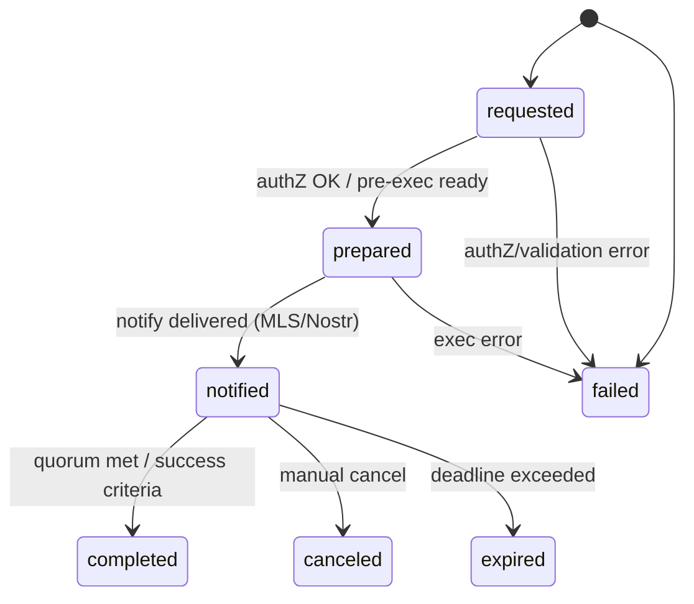

# NIP-SERVICE — High-Level Overview

Status: Draft for review
Spec: nip-service.md
Related profiles: NIP-KR (Rotation), NIP-AD-HARDENING (reference/adjacent implementation)

Purpose
Enable a server-side “service account” to safely participate in operator-initiated workflows using:
- Nostr for control-plane signaling (no sensitive plaintext)
- MLS for E2EE distribution of sensitive payloads to authorized admin groups
- Uniform authorization (jwt_proof + MLS membership)
- Idempotent, auditable action execution with optional quorum and deadlines
- Pluggable “profiles” (e.g., Rotation, Policy Update, AD Hardening) without reinventing the transport/authorization layer

What NIP-SERVICE accomplishes
- Standardizes how admins request actions (service-request) tied to a profile (e.g., nip-kr/0.1.0)
- Lets the relay act as an MLS “service member” to deliver sensitive results only to authorized admins
- Separates control-plane (Nostr) from data-plane (MLS), eliminating plaintext in infra/DB/logs
- Provides generic action lifecycle (requested → prepared → notified → completed) with acks/quorum and timeouts
- Keeps profiles focused on domain logic (parameters, payloads, policies), not transport/auth plumbing

Key building blocks
- service-request (kind 40910): Admin → Relay, non-sensitive parameters + jwt_proof
- service-notify (MLS preferred): Relay → Admin group(s), sensitive/non-sensitive payload per profile
- service-ack (kind 40911 or MLS): Admin → Relay, acks/approvals
- Service member: Relay’s MLS identity for secure group delivery
- Audit store: DB/Firestore for action entries, states, results, notify IDs

How it works (at a glance)
- Admin signs in (app attest + TOTP), obtains jwt_proof, and submits service-request specifying action_type + profile + params
- Relay authorizes (jwt_proof + MLS group membership), prepares/executes per profile, and distributes results via MLS to admin group(s)
- Acks accumulate to a quorum or a deadline; relay completes/cancels and updates audit state
- Profiles define schema/semantics (e.g., Rotation = NIP-KR); NIP-SERVICE provides consistent plumbing

System context (Mermaid)
```mermaid
flowchart LR
  subgraph Operators
    A[Admin App<br/>(MLS)]
  end
  subgraph ControlPlane
    R[Relay (Service Member)<br/>Nostr + MLS]
  end
  subgraph Data
    D[(DB/Firestore)<br/>Audit + Metadata]
  end
  subgraph ValidationPlane
    S[Server (e.g., loxation-server)<br/>Exec/Verify Plane]
  end

  A -- service-request/ack (Nostr) --> R
  R -- write audit + state --> D
  R -- service-notify (MLS) --> A
  S -- optional read/verify (profile-specific) --> D

  classDef node fill:#0f172a,stroke:#1f2937,color:#fff
  classDef data fill:#1f2937,stroke:#111827,color:#fff
  class A,R,S node
  class D data
```

End-to-end action flow (Mermaid)
```mermaid
sequenceDiagram
  autonumber
  participant Admin as Admin App
  participant Relay as Relay (Service Member)
  participant DB as DB/Firestore
  participant MLS as MLS Admin Group

  note over Admin,Relay: 1) Admin submits service-request (40910), e.g., action_type="rotation", profile="nip-kr/0.1.0"
  Admin->>Relay: service-request {action_id, client_id, profile, params, jwt_proof}

  note over Relay: 2) Authorize & prepare
  Relay->>Relay: Validate jwt_proof (JWKS), MLS membership, rate limits
  Relay->>DB: Create/Update service_actions/{action_id} (state=requested→prepared)

  note over Relay,MLS: 3) Execute profile semantics and notify
  Relay->>Relay: Execute per profile (e.g., KMS MACSign for rotation)
  Relay->>MLS: service-notify (MLS) — E2EE to admin group(s)
  Relay->>DB: Update notify_message_id; state=notified

  note over Admin,Relay: 4) Acks and completion
  Admin-->>Relay: service-ack (40911) or MLS ack
  Relay->>DB: Update quorum; on quorum/deadline → state=completed/canceled/expired
```

Generic action state machine (Mermaid)


Profile composition
- NIP-SERVICE provides generic envelopes, auth, lifecycle, and audit
- A profile supplies:
  - Tags and content schema (params and notify payloads)
  - Execution logic (what “prepare/notify/complete” means)
  - Policy knobs (quorum default, deadlines)
- Example profiles:
  - Rotation (NIP-KR): First implemented; relay generates new client secret, MACSign hash, writes metadata, notifies admins via MLS; server validates via MACVerify (grace windows)
  - AD Hardening (NIP-AD-HARDENING): Uses the same control/data-plane primitives, but with a different payload and execution logic (e.g., policy changes, enforcement toggles). Refer to NIP-AD-HARDENING.md for domain specifics.

Security properties
- Sensitive content only travels via MLS (E2EE); no plaintext in control-plane events, DB, or logs
- Strong operator auth: jwt_proof (attestation + TOTP + PoP) and MLS membership
- Idempotent actions keyed by action_id; concurrency controls per client/profile
- Audit trails with non-sensitive fields; versioned profiles with base64url_no_padding canonical encodings where applicable

Deployment notes
- The relay must maintain durable MLS state for its service member identity (e.g., SQLite + SQLCipher persisted via GCS Fuse in Cloud Run)
- DB/Firestore holds only non-sensitive audit/metadata for actions, plus any profile metadata (no plaintext)
- KMS “use” permissions scoped by role: relay may Sign (profile-dependent); server may Verify (profile-dependent)

Extending with a new profile (checklist)
- Define a profile_id and version (e.g., "org.policy/1.0.0")
- Specify tags and content schema for service-request params and MLS service-notify payloads
- Define execution semantics (prepare/notify/complete), policies (quorum, deadlines), and audit fields
- Provide test vectors and integration tests (authZ, idempotency, failure modes)
- Document any server-side responsibilities (e.g., validators, policy engines)

References
- NIP-SERVICE spec: nip-service.md
- Rotation profile: nip-kr.md
- AD Hardening (reference): NIP-AD-HARDENING.md
- MLS Protocol: RFC 9420
- Nostr Protocol: https://github.com/nostr-protocol/nostr
- JWT: RFC 7519
