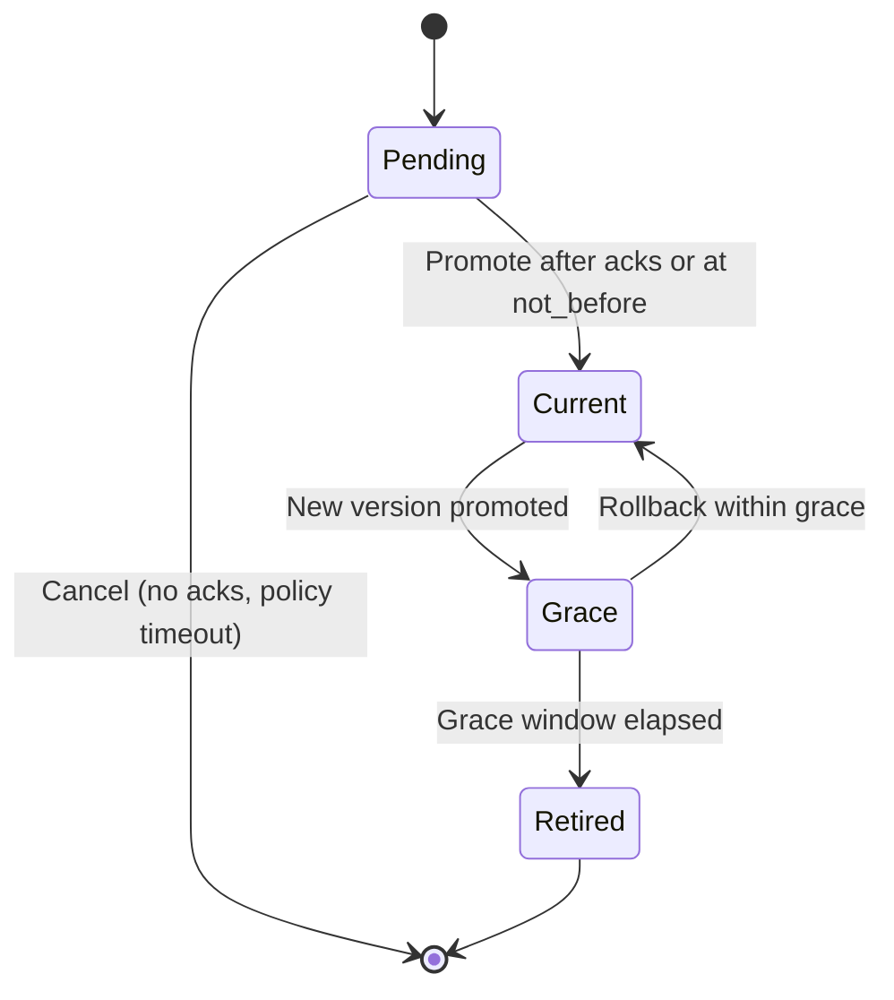

# High-Level Technical Architecture: Automated Static API Key (OAuth2/X-API) Rotation via MLS and rust-nostr-relay

Purpose
Provide a secure, automated, and auditable architecture to eliminate long-lived static client secrets for external services by:
- Automating rotation of OAuth2 client_secrets and X-API keys
- Distributing new secrets only to authorized admins via MLS E2EE
- Ensuring zero plaintext secret persistence server-side
- Preserving uptime through a configurable grace window

In-scope systems
- loxation-server (this repo): OAuth2 validation, /external-totp interfaces
- rust-nostr-relay (../rust-nostr-relay): Control plane for rotation, MLS distribution
- loxation-mls (../loxation-mls): Admin mobile client, MLS membership
- Firestore (shared): Versioned secret metadata storage, audit logs
- KMS/Secret Manager: Non-exportable MAC key (HMAC-SHA-256) for hashing (mac_key_ref)
- External clients: Service-to-service integrators using OAuth2 client credentials

Problem framing
Static credentials (client_secrets, API keys) are vulnerable to leaks and difficult to rotate reliably across stakeholders. The key challenges are:
- Secure generation and distribution of new secrets
- Authorization and operator identity assurance
- Zero plaintext persistence in servers and logs
- Compatibility with existing client credential flows (zero downtime)
- Auditability, policy enforcement, and rollback

Design goals
- Least exposure: plaintext secrets only in MLS E2EE to admin operators
- Deterministic verification: store only secret hashes and metadata in Firestore
- Strong admin auth: bind rotations to app-attested devices + TOTP + MLS membership
- Business continuity: configurable grace window for predictable cutover
- Auditability: immutable records of who, when, and why, without secrets

System context

```mermaid
flowchart LR
  subgraph Operators
    A[Admin App<br/>(React Native + MLS)]
  end
  subgraph ControlPlane
    R[rust-nostr-relay<br/>Nostr + MLS]
  end
  subgraph Data
    F[(Firestore)]
    K[(KMS / Secret Manager)]
  end
  subgraph ValidationPlane
    N[loxation-server<br/>(OAuth2/X-API validation + /external-totp)]
  end
  subgraph Integrators
    C[External Service Clients<br/>(OAuth2 client_credentials)]
  end

  A -- rotate-request/notify/ack --> R
  R -- write hashes + audit --> F
  R -- MACSign (HMAC) --> K
  N -- read-only validation --> F
  C -- client_id + client_secret --> N
```

Key flows

1) Rotation flow (admin-initiated)
```mermaid
sequenceDiagram
  autonumber
  participant Admin as Admin App (MLS)
  participant Relay as rust-nostr-relay
  participant KMS as KMS/Secret Manager
  participant FS as Firestore
  participant API as loxation-server

  Admin->>Relay: rotate-request (NIP-KR; jwt_proof, client_id, reason, grace)
  Relay->>Relay: Verify MLS admin (+ jwt_proof claims)
  Relay->>KMS: MACSign with non-exportable HMAC key (no key export)
  Relay->>Relay: Generate new secret (256-bit random, base64url)
  Relay->>Relay: Compute secret_hash via MACSign over canonical length‑prefixed input (client_id, version_id, secret)
  Relay->>FS: Write secrets/{version} (hash + metadata); update current/previous pointers
  Relay-->>Admin: MLS rotate-notify (plaintext secret + version + windows)
  Relay->>FS: Append audit record (oauth2_rotations)
  note over API,FS: API observes current/previous pointers for validation
```

2) Validation flow (external client calls OAuth2-protected API with KMS MAC verification)
```mermaid
sequenceDiagram
  autonumber
  participant Ext as External Client
  participant API as loxation-server
  participant FS as Firestore
  participant KMS as KMS MAC Key

  Ext->>API: client_id + client_secret (token or API call)
  API->>FS: Fetch client pointers (current, previous) + hash/time windows + algo + mac_key_ref (cached)
  API->>KMS: MACVerify( key=mac_key_ref, data=length_prefixed(client_id,version_id,presented_secret), sig=stored_hash )
  KMS-->>API: valid/invalid
  API->>KMS: If invalid and previous exists within grace → MACVerify(previous_version, ...)
  KMS-->>API: valid/invalid
  API-->>Ext: Accept/Reject (with structured reason)
  note over API: Short TTL caching of pointer metadata; constant-time compares; safety margins near window edges
```

3) Admin identity/authorization (jwt_proof)
```mermaid
sequenceDiagram
  autonumber
  participant Admin as Admin App
  participant API as loxation-server
  participant Relay as rust-nostr-relay

  Admin->>API: Sign nonce with npub + TOTP; request attested admin token
  API->>API: Verify App Attest binding + TOTP freshness
  API-->>Admin: Short-lived jwt_proof {sub,npub,amr:["app_attest","totp","pop"],aud="rust-nostr-relay",exp<=300s,nonce}
  Admin->>Relay: rotate-request + jwt_proof
  Relay->>Relay: Verify MLS membership + validate jwt_proof via JWKS
```

Data model (Firestore)
- Extend states to include: pending → current → grace → retired
- Include per-client admin group assignments for distribution authorization
- Add mac_key_ref and algo to each secret document

- oauth2_clients/{clientId}
  - current_version, previous_version, status, updated_at
- oauth2_clients/{clientId}/secrets/{versionId}
  - secret_hash, created_at, not_before, not_after, state (current|grace|retired), rotated_by, rotation_reason
- oauth2_rotations/{rotationId}
  - client_id, requested_by, new_version, old_version, not_before, grace_until, distribution_message_id, completed_at

State transitions (including two-phase promotion)


KMS-backed verification path (loxation-server)
- Use a non-exportable HMAC key in KMS/Secret Manager for MAC operations.
- Canonical hash input: secret_hash = base64url(HMAC_SHA256(KMS_mac_key, client_id + "|" + version_id + "|" + secret))
- Store alongside each secret: algo="HMAC-SHA-256", pepper_version (KMS key version or label), version_id.
- loxation-server obtains read-only access to Firestore and “use” permission (MACVerify) on the KMS MAC key; relay has MACSign/MACVerify for generating hashes; neither service can export the MAC key.

Two-phase promotion (prepare → promote) to avoid “lost secret”
- Stage 1 (prepare):
  - Relay writes new secret version with state=pending and not_before=T+Δ (Δ≥10 minutes by policy).
  - Relay distributes plaintext via MLS to per-client authorized admin group(s).
  - Relay waits for ack quorum or explicit admin confirmation.
- Stage 2 (promote):
  - Relay atomically (Firestore transaction) updates current_version to the new version; previous becomes state=grace with not_after=not_before+grace.
  - Auto-cancel path if acks not received by deadline; optional manual override.
- loxation-server treats pending as not yet valid and continues to honor current/previous until promotion.

Per-client MLS groups and least privilege
- Maintain admin authorization at client granularity; only authorized admins for client_id receive rotate-notify MLS payloads (plaintext).
- Support optional multi-approver quorum for sensitive clients before promotion.

Token versioning and immediate revoke
- Access tokens minted via client_credentials include client_version_id in claims.
- Immediate revoke (grace=0) invalidates tokens associated with the retired version_id; short token TTLs recommended.
- For durable grace, loxation-server honors previous_version until not_after, then rejects tokens referencing that version.

Cache coherence and consistency
- Use Firestore listeners (or relay-published control events) to invalidate server caches on pointer changes.
- Add small acceptance margin near not_before/not_after edges to tolerate minor clock skew; require NTP sync.
- Treat Firestore timestamps as source of truth; log and alert on excessive “previous” usage near not_after.

Disaster recovery (sealed escrow, optional)
- If policy enables DR, store an encrypted_secret blob alongside metadata:
  - Encrypted under a separate KMS key with access gated by quorum and elevated audit.
  - Never accessed by normal code paths; requires a break-glass runbook and heightened alerts.
  - Default policy: disabled (no escrow).

Canonical hash input and metadata
- Canonical input (length‑prefixed): len(client_id)||client_id||len(version_id)||version_id||len(secret)||secret (UTF‑8; 32‑bit big‑endian lengths).
- Metadata per secret: algo, mac_key_ref (KMS key/version reference), version_id, created_at, not_before, not_after, state ∈ {pending,current,grace,retired}, rotated_by, rotation_reason.

Trust boundaries and controls

```mermaid
flowchart TB
  classDef trusted fill:#1f2937,stroke:#0f172a,color:#fff
  classDef e2ee fill:#6b21a8,stroke:#4c1d95,color:#fff
  classDef boundary fill:#eab308,stroke:#a16207,color:#111
  classDef external fill:#0ea5e9,stroke:#0369a1,color:#fff

  A[Admin App<br/>(Attested + TOTP)]:::external
  R[rust-nostr-relay<br/>(privileged)]:::trusted
  F[(Firestore<br/>hashes + metadata)]:::trusted
  N[loxation-server<br/>read-only]:::trusted
  E2EE[MLS E2EE Channel]:::e2ee
  B{{Boundary: No plaintext secret persists<br/>outside MLS}}:::boundary

  A -- plaintext secret only via --> E2EE
  E2EE --> A
  R --> F
  N --> F
  A -- control --> R
  R -- control/audit --> F
  B
```

Security properties
- Plaintext restriction: Only MLS payloads ever contain plaintext secrets; no server logs or databases store plaintext.
- MAC hashing: Relay computes secret_hash via MACSign (HMAC-SHA-256) using a non-exportable key (mac_key_ref). Firestore stores only the MAC and metadata.
- Dual admin auth: MLS group membership + short-lived jwt_proof (App Attest + TOTP + PoP) bind operator, device, and presence.
- Firestore rules: Relay service account has write access to oauth2_clients/* and oauth2_rotations/*; loxation-server read-only.
- Rate limits: Rotation requests rate-limited per client and requester; denylist for suspicious clients.
- Observability: Structured logs (no secrets), metrics for grace usage, rotation frequency, invalid attempts.

Operational modes
- Normal rotation: Promote new version, set previous to “grace” until not_after.
- Immediate revoke: Grace = 0; previous secret revoked immediately; loxation-server rejects old tokens instantly.
- Rollback: Within grace, re-promote previous_version; update not_before/not_after accordingly.
- Disaster recovery (optional): If policy enables a relay-encrypted “encrypted_secret” in Firestore with KMS, break-glass runbooks can recover. Default is disabled.

Integration with /external-totp
- External systems use OAuth2 to call /v1/external/totp/verify and related endpoints.
- Rotation ensures their client_secret changes without downtime; loxation-server validates both current and previous during grace.

Deployment and cross-repo alignment
- This repo (loxation-server): implement version-aware client credential verification; no plaintext storage; caching and metrics.
- ../rust-nostr-relay: implement NIP-KR rotation service, MLS distribution, Firestore writes, audit logging.
- ../loxation-mls: admin UX, mobile TOTP, App Attest-bound npub, rotate-request with jwt_proof.
- Firestore (shared): central metadata and audit.
- KMS/Secret Manager: maintain non-exportable HMAC key(s); reference as mac_key_ref.

Diagrams index
- System context: See “System context” above
- Rotation flow: See “Rotation flow (admin-initiated)”
- Validation flow: See “Validation flow”
- Admin auth: See “Admin identity/authorization (jwt_proof)”
- Data model: See “Data model (Firestore)”
- State transitions: See “State transitions”
- Trust boundaries: See “Trust boundaries and controls”

Key advantages
- Eliminates long-lived static secrets as a persistent risk
- Secures distribution via MLS E2EE (no plaintext in infra)
- Minimizes downtime through graceful cutover
- Strong operator identity assurance (App Attest + TOTP + PoP)
- Unified auditability across relay and server with shared Firebase

Non-goals and compatibility
- Does not alter external client OAuth2 protocols; clients still present client_id + client_secret
- Does not rotate end-user/mobile TOTP secrets (managed separately by mobile and external-totp flows)
- Backwards compatible: validation code simply gains version-and-grace awareness

References
- NIP-KR specification: docs/nips/nip-kr.md
- Implementation plan: docs/architecture/oauth2-mls-key-rotation-implementation-plan.md
- Executive brief: docs/security/cio-brief-oauth2-mls-key-rotation.md
- Device verification: docs/guides/device-verification.md
- Mobile TOTP API: docs/api/mobile-totp.md
- External TOTP API: docs/api/external-totp.md
