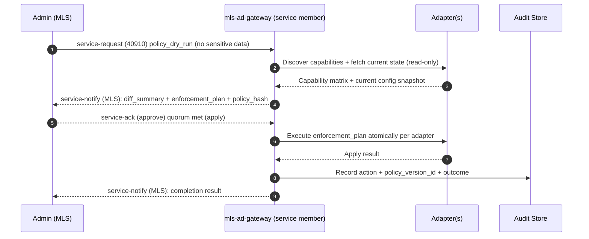
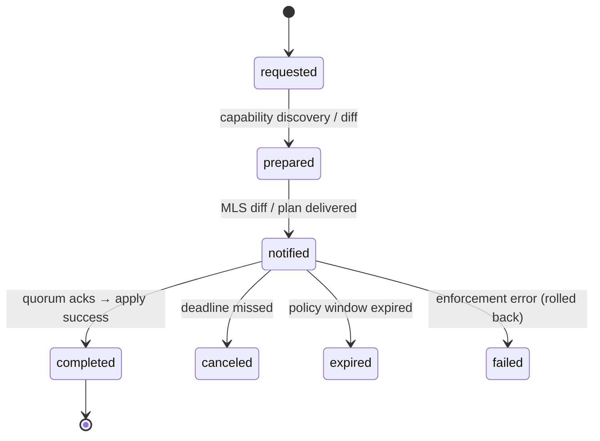

# NIP-AD-HARDENING: Directory Hardening Actions over Nostr + MLS

Status
- Draft (internal)
- NIP-AD-HARDENING version: 0.1.0
- Target projects:
  - mls-ad-gateway (service control-plane + MLS service member)
  - mls-ad-admin (operator client; MLS membership)
  - mls-ad-monitor (observability)
  - adapters: microsoft, samba, openldap, freeipa (src/adapters/*)
- Related docs:
  - nip-service.md (core service envelopes)
  - nip-kr.md (rotation profile example for reference style)
  - src/security/policies/* (policy primitives and enforcement)
  - src/gateway/* (consensus, quorum, audit, client)
  - src/adapters/* (provider-specific capability mapping)

## Abstract

NIP-AD-HARDENING defines a consistent, secure, and auditable method to evaluate and enforce directory hardening controls across Microsoft Active Directory, Samba AD, OpenLDAP, and FreeIPA using a Nostr-based control plane and an MLS-backed data plane. It introduces a “Hardening” service action profile that supports dry-run (diff), apply (enforce), snapshot, and revert with policy fingerprints, quorum approvals, staged activation (epochs), and rollback windows. Sensitive outputs (e.g., inventory, diffs, enforcement plans) are delivered via MLS to authorized admin groups; control-plane messages carry only non-sensitive parameters.

This specification ensures:
- Sensitive topology and inventory detail are never present in control-plane Nostr events or server logs
- A portable policy model abstracts provider differences while surfacing capabilities
- Two-phase commit and quorum-based approvals reduce operational risk
- Complete, versioned auditability tied to canonical policy hashes

## Motivation

Directory misconfigurations (weak password policies, legacy crypto, unconstrained delegation, Tier‑0 sprawl, NTLMv1/LM, unsigned/unencrypted protocols) drive compromise risk. Manual remediation is error-prone, disruptive, and lacks auditability and rollbacks. We need:
- A repeatable MLS-secured workflow with dry-run diffs and reversible changes
- A capability-aware policy model that degrades to detect/advice where enforcement is not possible
- A standard, portable spec aligning gateway, adapters, and operator tooling

## Terminology

- directory_id: Target directory scope (e.g., “corp.example.com” or a base DN label).
- hardening_action: One of “policy_dry_run” | “policy_apply” | “policy_snapshot” | “policy_revert”.
- policy_profile: Named bundle (e.g., “baseline”, “enterprise”, “strict”) or inline policy overrides.
- policy_version_id: Unique identifier (ULID/UUID) for a specific resolved policy snapshot.
- policy_hash: MAC of canonical policy JSON for idempotency and audit binding.
- capability: Adapter-reported support for enforcing a given control on a given provider.
- adapter: Platform-specific implementation (microsoft, samba, openldap, freeipa).
- epoch: Staged change window aligned to gateway consensus and rollback model.
- MLS admin group: Authorized operator group for this directory (receives MLS payloads).
- service member: The gateway’s MLS identity that participates in the group for action orchestration.

## Scope

- In-scope: Directory-plane configuration and identity-focused controls that can be read/written via directory protocols/APIs or adapter-managed configs.
- Out-of-scope: Pure host/GPO-only remediations, DC OS changes, and endpoint hardening that cannot be mediated from the directory plane (reported as advisory/detect-only with guidance).

## Security Goals

- Sensitive topology/diff details are MLS-only to authorized admins; no plaintext in control-plane Nostr events or logs.
- Idempotent, auditable actions tied to policy_hash and action_id.
- Two-phase commit, quorum approvals, and bounded rollback windows.
- Least-privilege service accounts and KMS non-exportable MAC keys.

## Non-Goals

- Replacing enterprise change management; this integrates with it (quorum/time windows).
- Guaranteeing enforcement where provider capability is absent; such controls degrade to detect/advisory with remediation guidance.

## Protocol Overview

NIP-AD-HARDENING is a profile bound to NIP-SERVICE 0.1.0 envelopes:
- service-request (Nostr 40910): Initiates hardening actions with non-sensitive parameters.
- service-notify (MLS preferred): Delivers sensitive diffs/results, policy fingerprints, and enforcement plans to authorized MLS admin groups.
- service-ack (MLS or Nostr 40911): Operator acks/approvals (quorum) and completion signals.

The gateway acts as an MLS service member in the target admin group(s). Idempotency is provided by action_id; concurrency policies restrict overlapping apply/revert for the same directory_id.

## Architectural Diagrams

1) Dry-run → Apply flow


2) State machine (generic)


## Control Families and Normative Action Set

Each control defines a key, intent, default thresholds by tier, enforcement type (enforce | detect), capability mapping, and provider notes.

1) password_policy_update
- Intent: Strong password posture with lockout protections.
- Default thresholds:
  - baseline: min_length ≥ 14, history ≥ 24, max_age ≤ 365d, min_age ≥ 1d, complexity on, reversible off, lockout_threshold 10, lockout_duration 15m, obs_window 15m
  - enterprise: min_length ≥ 16, history ≥ 24..48, max_age ≤ 180d, min_age ≥ 1d, lockout_threshold 5, lockout_duration 30m
  - strict: min_length ≥ 20, history ≥ 48, max_age ≤ 90d, min_age ≥ 1d, lockout_threshold 3, lockout_duration 60m
- Capability:
  - microsoft/samba: enforce (domain password policy attributes/GP-linked directory knobs)
  - openldap: enforce (ppolicy overlay)
  - freeipa: enforce (389-DS password policy)
- Detect-only: Fine-grained PSOs beyond base tier if unsupported by adapter.

2) kerberos_cipher_policy
- Intent: Disable legacy ciphers; require preauth and modern encryption.
- Requirements:
  - MUST prefer AES256/AES128; MUST disable RC4/DES/3DES where supported.
  - MUST require preauthentication for user/service principals (where supported).
  - SHOULD enable FAST/armored if available (advisory on providers lacking).
- Capability:
  - microsoft: enforce via msDS-SupportedEncryptionTypes, userAccountControl flags.
  - samba: enforce (aligned with AD schema).
  - freeipa/heimdal: partial enforce; some realm-level options advisory.
  - openldap: detect-only (KDC external).

3) ntlm_restriction
- Intent: Eliminate NTLMv1/LM; restrict NTLM usage.
- Requirements:
  - MUST disable LM hash storage and NTLMv1 (provider permitting).
  - SHOULD restrict NTLM altogether in favor of Kerberos (often host/GPO dependent).
- Capability:
  - microsoft: detect/advisory (GPO/registry).
  - samba: enforce on smb services; otherwise detect.
  - openldap/freeipa: detect-only.

4) ldap_security
- Intent: Require signing/channel binding; forbid simple binds over cleartext.
- Requirements:
  - MUST require LDAPS or StartTLS; MUST enforce LDAP signing/channel binding if supported.
  - MUST disable anonymous bind for modification; SHOULD disable entirely unless justified.
- Capability:
  - microsoft: enforce via domain/DC policy where scriptable; else detect/advisory (GPO boundary).
  - samba: enforce via smb/ldap configs (adapter).
  - openldap: enforce via olcSecurity/minssf.
  - freeipa (389-DS): enforce minssf/operational settings.

5) smb_security
- Intent: SMB signing/encryption; disable SMBv1.
- Requirements:
  - MUST disable SMBv1; MUST require signing; SHOULD require encryption for privileged shares.
- Capability:
  - samba: enforce via smb.conf policy (adapter).
  - microsoft: detect/advisory (GPO boundary).
  - openldap/freeipa: not applicable (detect-only).

6) admin_tiering_and_groups
- Intent: Limit Tier‑0 group membership; ensure Protected Users; maintain allowlists.
- Requirements:
  - MUST enforce exact allowlists for Domain Admins/Enterprise Admins (and analogous).
  - SHOULD add Tier‑0 accounts to Protected Users (where supported).
  - MUST prohibit generic service accounts in Tier‑0 groups.
- Capability: All providers enforceable via directory group ops.

7) delegation_controls
- Intent: Remove unconstrained delegation; prefer constrained with explicit SPN allowlists.
- Requirements:
  - MUST clear unconstrained delegation flags.
  - MUST set “Account is sensitive and cannot be delegated” for Tier‑0 users.
  - SHOULD migrate to constrained delegation with explicit SPNs.
- Capability:
  - microsoft/samba: enforce (userAccountControl flags, msDS-AllowedToDelegateTo).
  - freeipa: enforce via principal flags.
  - openldap: detect-only unless KDC semantics present.

8) stale_account_controls
- Intent: Disable stale/unused accounts; constrain interactive logon by role.
- Requirements:
  - MUST disable accounts inactive > 90 days (configurable).
  - MUST set non-interactive for service accounts; flag “Password never expires”.
- Capability: Enforceable via user attributes; gMSA conversion advisory.

9) laps_gmsa_guidance
- Intent: Managed secrets for local/admin/service accounts.
- Requirements:
  - SHOULD require LAPS2 or gMSA for Windows services where possible.
  - MUST report non-compliant services and provide migration plan.
- Capability:
  - microsoft: detect/advisory (directory objects + host/GPO dependency).
  - others: N/A.

10) audit_and_observability
- Intent: Ensure capture of changes and critical events.
- Requirements:
  - MUST log all hardening actions with policy_version_id, policy_hash, action_id.
  - SHOULD export signals to SIEM; MUST avoid sensitive plaintext in logs.
- Capability: Enforced at gateway.

## Policy Model

- policy_profile: “baseline” | “enterprise” | “strict” (extensible). Profiles define per-control thresholds and enforce vs detect flags.
- Inline policy overrides supported; schema-validation and capability gating REQUIRED.
- Scope selectors:
  - include_scopes: [] and exclude_scopes: [] (DNs, OUs, groups, principal types).
  - emergency_accounts_allowlist: [] (exemptions, documented in diff/audit).
- Capabilities matrix produced during dry-run; enforcement MUST only attempt controls where capability=enforceable; others are advisory.

## Canonical Encoding and policy_hash (Normative)

- Canonical JSON (UTF‑8) with deterministic key ordering; integers/booleans/lists normalized; no Unicode normalization beyond UTF‑8.
- policy_hash_input = len(profile) || profile || len(directory_id) || directory_id || len(policy_json) || policy_json
  - len(x): 32-bit unsigned big-endian length of UTF‑8 bytes of x; “||” denotes concatenation.
- policy_hash = base64url_no_padding( MAC(key=mac_key_ref, algo=HMAC-SHA-256, data=policy_hash_input) )
- base64url_no_padding is REQUIRED for all encodings in this spec; non-canonical encodings MUST be rejected.
- Store algo and mac_key_ref (exact key version) alongside policy.

### KMS Provider Neutrality

- GCP: Cloud KMS HMAC-SHA-256; mac_key_ref SHOULD be the full CryptoKeyVersion.
- AWS: KMS HMAC Sign/Verify; mac_key_ref SHOULD identify exact key id/version.
- Azure: Managed HSM HMAC-SHA-256; mac_key_ref SHOULD be exact version URI.
- Keys MUST be non-exportable and restricted to Sign/Verify.

## Authorization Requirements (Normative)

- The relay/gateway MUST verify the service-request sender is a member of an authorized MLS admin group for the directory_id.
- The relay/gateway MUST require a short-lived jwt_proof binding device/app integrity, TOTP, and proof-of-possession:
  - Verify signature via loxation-server JWKS.
  - Check aud, exp/iat (and nbf if present).
  - Ensure amr includes app_attest and totp.
  - Bind to PoP of the admin’s npub (cnf.jkt or event signed by attested npub).
- Enforce per-user and per-directory rate limits and deny-lists.
- Scope MLS distribution of service-notify payloads only to authorized group(s) for directory_id.

## Quorum, Timeouts, and Policy (Normative)

- Default quorum:
  - policy_dry_run: 0 acks (no enforcement).
  - policy_apply / policy_revert: 2 acks (configurable by directory criticality).
- Ack deadline: 30 minutes (configurable). If quorum unmet by deadline, CANCEL.
- Promote deadline SLO: target completion within 10 minutes of quorum.
- Rollback window: default 7 days. revert requires 1 ack by default (configurable).

## Atomicity, Idempotency, and Concurrency

- action_id REQUIRED; gateway MUST treat action_id as idempotency key.
- Duplicate service-request for same action_id MUST NOT re-apply changes; subsequent prepared/notified steps MUST be safe no-ops.
- One active apply/revert per directory_id; dry-runs may run concurrently with unique action_id.
- Apply operations MUST be all-or-nothing per adapter using transactions or compound ops; on partial failure, rollback automatically and mark action failed.

## Data Model (Audit)

- ad_policies/{policyId}
  - profile: "baseline" | "enterprise" | "strict" | "custom"
  - policy_json: object
  - policy_hash: string
  - algo: "HMAC-SHA-256"
  - mac_key_ref: string
  - created_by: userId
  - created_at: timestamp

- ad_policy_versions/{policyVersionId}
  - directory_id: string
  - policy_hash: string
  - profile: string
  - capability_summary: object
  - diff_summary: object
  - state: "prepared" | "current" | "previous" | "retired"
  - not_before: timestamp|null
  - grace_until: timestamp|null
  - epoch_id: string|null
  - created_at / updated_at: timestamp

- service_actions/{actionId} (reuse NIP-SERVICE)
  - action_type: "hardening"
  - profile: "nip-ad-hardening/0.1.0"
  - client_id: directory_id
  - requested_by: userId
  - mls_group: string
  - state: "requested" | "prepared" | "notified" | "completed" | "canceled" | "expired" | "failed"
  - quorum: { required: number, acks: number }
  - notify_message_id: string|null
  - outcome: string|null
  - created_at / updated_at: timestamp

## NIP-SERVICE Binding and Message Formats

Kinds and Tags (Enterprise/private experimental)
- 40910: service-request
- 40911: service-ack
- 40912: service-notify (allowed for non-sensitive; MLS preferred for sensitive)
- Required tags:
  - ["service", "hardening"]
  - ["profile", "nip-ad-hardening/0.1.0"]
  - ["client", directory_id]
  - ["mls", mls_group]
  - ["action", action_id]
  - ["nip-service", "0.1.0"]

### service-request (Nostr 40910) content (JSON)

- Fields:
  - action_type: "policy_dry_run" | "policy_apply" | "policy_snapshot" | "policy_revert"
  - action_id: string (ULID/UUID)
  - client_id: string (directory_id)
  - profile: "nip-ad-hardening/0.1.0"
  - params: object:
    - policy_profile: "baseline" | "enterprise" | "strict"
    - policy_json: object (optional overrides)
    - include_scopes: string[]
    - exclude_scopes: string[]
    - emergency_accounts_allowlist: string[]
    - safety: { require_dry_run_first: boolean, block_if_capability_missing: boolean }
    - not_before: number (unix ms; optional staged apply)
    - rollback_window_ms: number (default 604800000)
    - revert_to_version: string|null (for policy_revert)
  - jwt_proof: string (compact JWS)

Example:
```json
{
  "action_type": "policy_dry_run",
  "action_id": "01JM8Y5ZJ4GSD4N7T6X9QZP3R0",
  "client_id": "corp.example.com",
  "profile": "nip-ad-hardening/0.1.0",
  "params": {
    "policy_profile": "enterprise",
    "policy_json": {},
    "include_scopes": ["OU=Servers,DC=corp,DC=example,DC=com"],
    "exclude_scopes": ["CN=EmergencyAdmins,OU=Users,DC=corp,DC=example,DC=com"],
    "emergency_accounts_allowlist": ["CN=BreakGlass01,OU=Users,DC=corp,DC=example,DC=com"],
    "safety": { "require_dry_run_first": true, "block_if_capability_missing": true }
  },
  "jwt_proof": "eyJhbGciOiJSUzI1NiIsInR5cCI6IkpXVCJ9..."
}
```

### service-notify (MLS body; sensitive)

- MUST include identifiers: action_type, action_id, client_id, profile, issued_at, relay_msg_id.
- Dry-run example:
```json
{
  "action_type": "hardening",
  "action_id": "01JM8Y5ZJ4GSD4N7T6X9QZP3R0",
  "client_id": "corp.example.com",
  "profile": "nip-ad-hardening/0.1.0",
  "issued_at": 1767312000500,
  "relay_msg_id": "mls-12345",
  "policy_version_id": "01JM8YG1Y2ZAB3CDEF45G6H7I8",
  "policy_hash": "b64url_no_pad",
  "algo": "HMAC-SHA-256",
  "mac_key_ref": "projects/EXAMPLE/.../cryptoKeyVersions/7",
  "capabilities": [
    { "control": "password_policy_update", "adapter": "microsoft", "enforcement": "enforce" },
    { "control": "ntlm_restriction", "adapter": "microsoft", "enforcement": "detect" }
  ],
  "diff_summary": [
    { "control": "password_policy_update", "current": {"min_length": 8}, "target": {"min_length": 16}, "impact": "low" },
    { "control": "delegation_controls", "current": {"unconstrained": ["svc/sql01"]}, "target": {"unconstrained": []}, "impact": "medium" }
  ],
  "enforcement_plan": [
    { "step": 1, "adapter": "microsoft", "op": "set-domain-password-policy", "params": {"min_length": 16, "history": 24, "complexity": true} },
    { "step": 2, "adapter": "microsoft", "op": "clear-unconstrained-delegation", "targets": ["CN=svc_sql01,OU=Service,DC=corp,DC=example,DC=com"] }
  ]
}
```

### service-ack (MLS or Nostr 40911)

- Fields:
  - action_type: "hardening"
  - action_id: string
  - client_id: directory_id
  - profile: "nip-ad-hardening/0.1.0"
  - ack_by: string (userId or MLS member id)
  - ack_at: number (unix ms)
  - result: optional object (e.g., {"approve_apply": true})

## Validation Rules (Normative; selected)

- password_policy_update:
  - min_length/history/complexity/reversible/lockout_threshold/duration MUST meet tier thresholds; apply atomically per provider.
- kerberos_cipher_policy:
  - Principals MUST exclude RC4/DES/3DES; MUST require preauth; providers lacking enforcement MUST report detect-only with remediation.
- delegation_controls:
  - Unconstrained delegation flags MUST be cleared; Tier‑0 users MUST be “sensitive and cannot be delegated”; constrained delegation MUST list explicit SPNs and be scoped to include_scopes.
- admin_tiering_and_groups:
  - Target Tier‑0 group membership MUST equal allowlist; removals MUST appear in diff and require quorum ≥ 2; emergency_accounts_allowlist is exempt but MUST be documented.

## Operational Considerations

- Safety valves: require_dry_run_first=true by default for apply; block_if_capability_missing=true.
- Maintenance windows: not_before scheduling with epoch gating; out-of-window applies MUST be rejected (policy_violation).
- Partial failure handling: plan MUST be all-or-nothing per adapter; otherwise rollback partial steps automatically and emit failed with reason.
- Cache coherence: Gateway SHOULD invalidate adapter caches after promotion; rely on epoch state for “current/previous” plans during rollback window.

## Error Handling

- unauthorized_request: requester not in MLS admin group or invalid jwt_proof.
- policy_violation: out-of-window apply; thresholds exceed policy; capability missing with blocking safety on.
- capability_unsupported: requested enforce not supported by adapter/provider.
- conflict: concurrent apply/revert in progress; duplicate action_id.
- not_found: unknown directory_id or policy_version.
- internal_error: unexpected failures (adapter, KMS MAC).

## Privacy, Logging, and Retention

- Never include sensitive topology/inventory in control-plane Nostr events or plaintext logs.
- Include action_id, directory_id, policy_version_id, and timestamps in logs for correlation.
- Retain actions and policy versions for 12–24 months (governance-defined); purge retired entries per policy.

## Threat Model (Summary)

- Unauthorized changes: MLS membership + jwt_proof + quorum approvals.
- Misconfiguration/lockout risk: dry-run diffs, staged not_before, rollback windows.
- Gateway compromise: KMS Sign/Verify-only keys, least-privilege IAM, no sensitive MLS plaintext persisted, active monitoring.
- Insider misuse: Audit trails bound to policy_hash and SIEM export.

## Interoperability and Kind Registry Guidance

- Profile ID: "nip-ad-hardening/0.1.0"
- Kinds: reuse NIP-SERVICE 40910 (request), 40911 (ack); 40912 allowed for non-sensitive notify (MLS preferred).
- Deployments SHOULD namespace kinds internally until a public registry is finalized.

## Test Guidance

- Unit: schema validation, capability discovery, policy_hash determinism, idempotency by action_id.
- Integration: dry_run → ack quorum → apply → verify → revert within rollback window across adapters.
- Security: ensure no sensitive data in control-plane; MLS-only distribution; KMS MAC usage tested with fixed key fixtures.

## Versioning of this Spec

- Version tag MUST be included in service-request tags, e.g., ["profile","nip-ad-hardening/0.1.0"].
- Backwards-incompatible changes MUST bump the major version; additive fields SHOULD be ignored by older implementations.

## References

- NIP-SERVICE: docs/nip-service.md
- NIP-KR (style/profile exemplar): docs/nip-kr.md
- MLS Protocol: https://www.rfc-editor.org/rfc/rfc9420
- Nostr Protocol: https://github.com/nostr-protocol/nostr
- JSON Web Token (JWT): https://www.rfc-editor.org/rfc/rfc7519
- Microsoft AD hardening refs: Kerberos etypes, delegation, password policies
- OpenLDAP ppolicy overlay; 389-DS password policies (FreeIPA)
