# NIP-KR: Key Rotation over Nostr + MLS for OAuth2/X-API Secrets

Status
- Draft (internal)
- NIP-KR version: 0.1.0
- Target projects:
  - rust-nostr-relay (rotation control plane, MLS distribution)
  - loxation-server (OAuth2/X-API secret validation; grace windows)
  - loxation-mls (admin operator client)
- Related docs:
  - high-level-architecture-automatic-api-key-rotation.md
  - oauth2-mls-key-rotation-implementation-plan.md
  - kms-mac-verification-implementation.md
  - cio-brief-oauth2-mls-key-rotation.md
  - competitive-analysis-automatic-api-key-rotation.md

## Abstract

NIP-KR defines a consistent, secure, and auditable method to request, distribute, and roll over OAuth2 client secrets and X-API keys used by services interfacing with systems like /external-totp. It combines:
- Nostr envelopes for control-plane signaling (no plaintext secrets)
- MLS (Messaging Layer Security) for end-to-end encrypted distribution of plaintext secrets to authorized administrators (“admin” MLS group)
- Firestore as the source of truth for versioned secret metadata and audit records

This specification ensures:
- Plaintext secrets are never persisted in server storage or logs
- Only MACed (hashed) secrets are stored centrally
- A controlled grace window allows seamless client cutover
- Complete auditability without exposing sensitive material

## Motivation

Static client secrets and API keys present material risk when leaked. Manual rotations are slow, error-prone, and commonly distributed over insecure channels. We need:
- A secure distribution channel (MLS)
- A repeatable, operator-friendly workflow (admin app)
- A control plane that coordinates rotation atomically across systems (rust-nostr-relay)
- A validation plane that honors versioned secrets with overlap windows (loxation-server)
- A standard, portable spec to align implementations (this NIP-KR document)

## Terminology

- client_id: Identifier for an OAuth2/X-API client.
- secret: Plaintext client_secret or API key. NEVER persisted in Firestore/logs.
- version_id: Unique identifier (ULID preferred) for a specific secret version.
- rotation_id: Unique identifier for a rotation request/operation (ULID/UUID).
- MLS admin group: Authorized operator group with permission to rotate secrets.
- Relay: rust-nostr-relay providing control-plane logic and MLS distribution.
- Server: loxation-server that validates client credentials.
- Firestore: Shared database storing secret metadata, version pointers, and audit records.
- Grace window: The time overlap where both new (current) and old (previous) secrets are accepted.
- mac_key_ref: Provider-specific reference to the exact MAC key version used to compute a secret_hash (e.g., a full KMS key version resource name). Replaces prior “pepper_version”.

## Scope

- OAuth2 client_secrets used for confidential clients and service-to-service workflows.
- X-API keys used by external services and integrations.
- Not intended for end-user access tokens or refresh tokens.
- Nostr events are used only for non-sensitive control signaling; MLS carries sensitive plaintext.

## Security Goals

- Plaintext secrets only visible to authorized admin operators via MLS.
- Only secret MACs + metadata persisted centrally.
- Strong operator authentication (MLS membership; jwt_proof; proof-of-possession).
- Comprehensive audit trail without sensitive exposure.
- Low operational risk with well-defined rollback and grace policies.

## Non-Goals

- Changing external client protocols (client credentials remain client_id + client_secret).
- Defining general-purpose MLS or Nostr security models beyond what is needed here.

## Protocol Overview

NIP-KR introduces three message types:
- rotate-request: Nostr control-plane event containing non-sensitive rotation parameters.
- rotate-notify: MLS payload containing the plaintext new secret and associated metadata, distributed to the “admin” MLS group.
- rotate-ack: MLS message or Nostr event indicating acknowledgement by an admin operator.

The rust-nostr-relay:
- Verifies request authorization (MLS group membership AND jwt_proof; see Authorization)
- Generates the new secret and version_id
- Computes secret_hash via KMS MACSign using canonical input (see Canonical Encoding)
- Writes metadata and pointers to Firestore (hash only, no plaintext)
- Distributes plaintext secret via MLS to the admin group
- Records an audit entry (oauth2_rotations)
- Enforces quorum/timeouts and marks rotation completed or canceled

loxation-server:
- Validates client credentials using KMS MACVerify against current secret_hash; falls back to previous if within grace
- Enforces not_before/not_after windows with small tolerance for clock skew
- Provides observability via audit logs and metrics

## Architectural Diagrams

1) End-to-end rotation flow
```mermaid
sequenceDiagram
  autonumber
  participant Admin as Admin App (React Native + MLS)
  participant Relay as rust-nostr-relay
  participant FS as Firestore
  participant API as loxation-server
  participant Ext as External Client

  Admin->>Relay: rotate-request (Nostr; no plaintext)
  Relay->>Relay: Verify MLS admin + jwt_proof
  Relay->>Relay: Generate secret + version_id; MACSign(secret_hash)
  Relay->>FS: Write secret MAC + metadata; update version pointers (txn)
  Relay-->>Admin: rotate-notify (MLS; includes plaintext secret)
  Admin-->>Relay: rotate-ack (optional; MLS or Nostr)
  API->>FS: Read current/previous version pointers and hashes (cache)
  API->>API: Validate presented secret (current → previous if within grace)
  API-->>Ext: Authorized (or rejected)
```

2) Component boundaries
```mermaid
flowchart LR
  A[Admin App (MLS)] -->|rotate-request/notify/ack| R[rust-nostr-relay]
  R -->|write hash + audit| F[(Firestore)]
  S[loxation-server] -->|read hashes + pointers| F
  X[External Client] -->|OAuth2/X-API calls| S
```

3) Secret lifecycle

```mermaid
stateDiagram-v2
  [*] --> Pending
  Pending --> Current: Promote after acks or at not_before
  Current --> Grace: New version promoted
  Grace --> Retired: Grace elapsed
  Grace --> Current: Rollback within grace
  Pending --> [*]: Cancel (no acks; policy timeout)
  Retired --> [*]
```


## Canonical Encoding and Base64url (Normative)

- All MAC computations use a delimiter-safe, length-prefixed canonical input:
  - data = len(client_id) || client_id || len(version_id) || version_id || len(secret) || secret
  - Where len(x) is a 32-bit unsigned big-endian length of the UTF-8 bytes of x, and “||” denotes concatenation.
  - No Unicode normalization. Values are UTF-8 as provided.
- secret_hash = base64url_no_padding( MAC(key=mac_key_ref, algo=HMAC-SHA-256, data=canonical_input) )
- base64url_no_padding is REQUIRED for all encoded MACs and any base64url values defined by this spec. Non-canonical (padded) encodings MUST be rejected.

## Data Model (Firestore)

Documents and collections:
- oauth2_clients/{clientId}
  - current_version: string
  - previous_version: string|null
  - updated_at: timestamp
  - status: "active" | "suspended" | "revoked"
  - admin_groups: string[] (e.g., ["admin"]) — authorized MLS group(s) for this client

- oauth2_clients/{clientId}/secrets/{versionId}
  - secret_hash: base64url_no_padding(HMAC_SHA256(mac_key_ref, canonical_input))
  - algo: "HMAC-SHA-256"
  - mac_key_ref: string (provider-specific exact key version reference; e.g., full KMS cryptoKeyVersion resource)
  - created_at: timestamp
  - not_before: timestamp
  - not_after: timestamp|null
  - state: "pending" | "current" | "grace" | "retired"
  - rotated_by: userId (admin initiator)
  - rotation_reason: string

- oauth2_rotations/{rotationId}
  - client_id: string
  - requested_by: userId
  - mls_group: string (e.g., "admin")
  - new_version: string
  - old_version: string|null
  - not_before: timestamp
  - grace_until: timestamp|null
  - distribution_message_id: string (MLS message id)
  - completed_at: timestamp|null
  - quorum: { required: number, acks: number }
  - outcome: "promoted" | "canceled" | "expired" | "rolled_back"

## Cryptographic Requirements

- Secret generation: at least 256 bits of entropy; encode with base64url (no padding).
- MAC: HMAC-SHA-256 with a non-exportable key (mac_key_ref).
  - Canonical input MUST be the length-prefixed encoding defined above.
  - Relay uses MACSign to compute secret_hash; loxation-server uses MACVerify to validate presented secrets.
  - Store algo="HMAC-SHA-256" and mac_key_ref (exact key version) alongside each secret.
- Storage: Only secret_hash and metadata in Firestore; zero plaintext logging.
- Transport:
  - Nostr control-plane events MUST NOT contain plaintext secrets.
  - MLS payloads carry plaintext secrets to authorized “admin” group members only.
- TLS MUST be used for all network transport paths.

### KMS Provider Neutrality

- GCP: Cloud KMS CryptoKey with purpose=MAC, algo=HMAC_SHA256; mac_key_ref SHOULD be the cryptoKeyVersion name.
- AWS: KMS HMAC (HMAC-SHA-256) with Sign/Verify permissions; mac_key_ref SHOULD identify the exact key version/ID used.
- Azure: Managed HSM with HMAC-SHA-256; mac_key_ref SHOULD identify the exact version URI.
- Services MUST have “use” (Sign/Verify) permissions only; key export MUST NOT be possible.

## Authorization Requirements

- The relay MUST verify the rotate-request sender is a member of an authorized MLS admin group for the client_id.
- The relay MUST require a short‑lived jwt_proof binding the request to a verified admin in loxation-server (production). Validation:
  - Verify signature via loxation-server JWKS.
  - Check aud, exp/iat (and nbf if present), and that amr includes at least app_attest and totp.
  - Validate nonce freshness (match the issued challenge).
  - Bind to proof-of-possession of the admin’s npub:
    - EITHER include cnf.jkt referencing a JWK for the npub and verify PoP, OR
    - Require that the rotate-request Nostr event signature is produced by the attested npub carried in jwt_proof (recommended).
- The relay MUST support per-client (or per-domain) MLS admin groups. Rotate-notify distribution MUST be scoped so that only admins authorized for the specific client_id receive plaintext.
- loxation-server MUST be read-only for oauth2_clients/* secrets and pointers. Only relay service account MAY write.

### Attested Admin Token (jwt_proof)

- Format: Compact JWS signed by loxation-server.
- Lifetime: exp ≤ 300 seconds; include iat and (optionally) nbf.
- Audience: aud = "rust-nostr-relay" (or your relay identifier).
- Nonce: a relay-provided or server-provided nonce to prevent replay.
- Required claims (example):
```json
{
  "sub": "admin-user-id",
  "npub": "npub1...",
  "mls_group": "admin",
  "amr": ["app_attest", "totp", "pop"],
  "nonce": "relay-nonce-or-server-nonce",
  "aud": "rust-nostr-relay",
  "iat": 1767312000,
  "exp": 1767312300
}
```
- Verification at the relay:
  - Verify signature (JWKS), claims (aud/exp/iat/nbf), and presence of app_attest+totp in amr.
  - Enforce PoP: either cnf.jkt or event-signature-by-npub check MUST pass.
  - Independently verify MLS membership of the message sender.

## Quorum, Timeouts, and Policy (Normative)

- not_before minimum (policy): Δ ≥ 10 minutes from prepare.
- Default quorum: 1 ack (may be overridden per client classification to majority or specific count).
- Ack deadline: 30 minutes from prepare (configurable). If quorum not met by deadline, CANCEL the rotation.
- Promote deadline SLO: target promotion within 10 minutes of ack quorum.
- Grace windows: default 7 days; maximum 30 days (policy). grace_until = not_before + grace_duration_ms.

## Atomicity, Idempotency, and Concurrency

- All pointer flips and state transitions MUST be performed in a Firestore transaction with preconditions on current/previous to prevent races.
- Idempotency key: rotation_id is REQUIRED. Duplicate rotate-request for the same rotation_id MUST NOT create additional versions; subsequent prepares/promotes MUST be safely no-ops.
- Concurrent rotations for the same client_id MUST be rejected with conflict.
- Cache invalidation: relay SHOULD emit a control event or rely on Firestore listeners to invalidate server caches on promotion.

## Message Formats

NIP-SERVICE profile binding
- This specification can be invoked via NIP-SERVICE (see nip-service.md). In production, the rotate-request payload SHOULD be carried as an MLS application message to the admin group and transported via a Nostr kind 445 envelope (MLS-first). The generic 40910 service-request is a dev/test fallback.
- Implementations MAY continue to accept the native rotate-request (kind 40901). A deployment can support both, aliasing MLS-first/40910 requests to this profile.

### rotate-request (Nostr event)

- kind: enterprise/private experimental (40901)
- tags (array) MUST include:
  - ["client", client_id]
  - ["mls", mls_group]
  - ["rotation", rotation_id]
  - ["reason", rotation_reason]
  - ["nip-kr", "0.1.0"]
- content (JSON):
  - client_id: string
  - rotation_id: string (ULID/UUID)
  - rotation_reason: string
  - not_before: number (unix ms)
  - grace_duration_ms: number
  - mls_group: string (e.g., "admin")
  - jwt_proof: string (compact JWS)
- signature: per existing Nostr event signature requirements

Example:
```json
{
  "client_id": "ext-totp-svc",
  "rotation_id": "01JM8VEXA8C5Q2DG0E5B1N0K4W",
  "rotation_reason": "Routine quarterly rotation",
  "not_before": 1767312000000,
  "grace_duration_ms": 604800000,
  "mls_group": "admin",
  "jwt_proof": "eyJhbGciOiJSUzI1NiIsInR5cCI6IkpXVCJ9..."
}
```

MLS-first delivery (preferred)
- Carry the rotate-request JSON as the inner MLS application message addressed to the authorized admin group and transport it via a Nostr kind 445 envelope.
- The outer 445 event MUST include only non-sensitive routing tags (e.g., ["h", group_id]); do not expose action types or profiles in tags.
- Decrypt gating: Implementations SHOULD NOT attempt to decrypt every 445. Attempt MLS-first decrypt/dispatch only for groups flagged as service_member=true (or equivalent capability) in the group registry. See “Decrypt Gating” in nip-service.md for guidance.
- Observability: Never log plaintext; track only non-sensitive metrics (attempted/ok/err/skipped by group).

NIP-SERVICE delivery (dev fallback: service-request, kind 40910)

- When using NIP-SERVICE, clients send service-request 40910 with tags:
  - ["service", "rotation"], ["profile", "nip-kr/0.1.0"], ["client", client_id], ["mls", mls_group], ["action", rotation_id], ["nip-service", "0.1.0"]
- Content maps to rotate-request fields as:
  - params.rotation_reason → rotation_reason
  - params.not_before → not_before
  - params.grace_duration_ms → grace_duration_ms
  - jwt_proof is provided at the top-level of service-request content
- The relay MUST process either 40901 (native) or 40910 (NIP-SERVICE) equivalently for this profile.

### rotate-notify (MLS payload; contains plaintext secret)

JSON body:
- client_id: string
- version_id: string
- secret: string (base64url, 256-bit entropy; no padding)
- secret_hash: string (base64url; no padding)
- mac_key_ref: string (exact key version reference)
- not_before: number (unix ms)
- grace_until: number (unix ms) | null
- rotation_id: string
- issued_at: number (unix ms)
- relay_msg_id: string (identifier for auditing)

Example:
```json
{
  "client_id": "ext-totp-svc",
  "version_id": "01JM8VEZAMG2DK6T4S9N7TT1C8",
  "secret": "2nC0WJ6d-3Jb0L6Wj7o5n9Jx9aQmH6r1bE3xqfIuF9k",
  "secret_hash": "jY8JJ0JgYt9E5C8z7f2i4n3o5qUqfVfJ5y2J3bC8n0A",
  "mac_key_ref": "projects/EXAMPLE/locations/global/keyRings/kr-oauth-rotation/cryptoKeys/kr-mac/cryptoKeyVersions/1",
  "not_before": 1767312000000,
  "grace_until": 1767916800000,
  "rotation_id": "01JM8VEXA8C5Q2DG0E5B1N0K4W",
  "issued_at": 1767312000500,
  "relay_msg_id": "mls-1234567890"
}
```

### rotate-ack (MLS message or Nostr event)

Body:
- rotation_id: string
- client_id: string
- version_id: string
- ack_by: string (userId or MLS member id)
- ack_at: number (unix ms)

If sent as Nostr:
- kind: enterprise/private experimental (40902)
- tags:
  - ["rotation", rotation_id]
  - ["client", client_id]
  - ["version", version_id]
  - ["nip-kr", "0.1.0"]

## Validation Rules (Normative)

- The relay MUST:
  - Verify MLS admin group membership for the requester (per-client authorization).
  - Validate jwt_proof; reject on failure.
  - Generate secrets with at least 256 bits entropy, base64url-encode (no padding).
  - Compute secret_hash = base64url(HMAC_SHA-256(mac_key_ref, canonical_input)) via KMS MACSign.
  - Store only secret_hash and metadata (including algo and mac_key_ref); NEVER store plaintext.
  - Implement two-phase promotion:
    * Prepare: create secret with state=pending and not_before = now + Δ (Δ ≥ policy minimum, e.g., 10 minutes); distribute plaintext via MLS to authorized admins; await ack quorum or explicit confirmation.
    * Promote: atomically set current_version to new; set previous to state=grace with not_after = not_before + grace; cancel if acks not received by deadline (policy).
  - Distribute the plaintext secret via MLS only to the authorized admin group(s) for that client_id.
  - Record oauth2_rotations audit entries (including distribution_message_id, not_before, grace_until, quorum, outcome).
  - Use transactions and rotation_id idempotency to avoid races and duplicates.

- loxation-server MUST:
  - Validate client credential against current using KMS MACVerify; if fail, check previous when within grace (with small safety margin for clock skew).
  - Enforce not_before and not_after windows strictly (±2s tolerance recommended).
  - Stamp tokens minted via client_credentials with client_version_id and enforce immediate revoke semantics: when grace=0, invalidate tokens bound to the retired version. Prefer short token TTLs.
  - Reject retired secrets or outside-window usage with standardized errors.
  - Avoid logging plaintext; log rotation_id, client_id, version used, result code; use constant-time comparisons where applicable.

- Firestore rules MUST:
  - Restrict write access to oauth2_clients/* and oauth2_rotations/* to the relay service account.
  - Allow loxation-server read-only access for validation.

## Operational Considerations

- Cache coherence and consistency:
  - Use Firestore listeners or relay-published control events to invalidate caches on pointer changes.
  - Treat Firestore timestamps as source of truth; require time sync (NTP); add small acceptance margins near not_before/not_after.
  - Alert on excessive “previous” usage near not_after.

- Disaster Recovery (optional, policy-gated):
  - If enabled, store an encrypted_secret blob (sealed with a separate KMS key) alongside metadata.
  - Access requires quorum approval and elevated audit; never accessed by normal code paths.
  - Default policy: disabled (no escrow).

## Error Handling

Standardized error classes (implementation-mapped to HTTP/JSON):

- unauthorized_request: requester not in MLS admin group or invalid jwt_proof.
- policy_violation: grace duration exceeds max; rotation too frequent; client suspended.
- conflict: concurrent rotation in progress; duplicate rotation_id.
- not_found: unknown client_id.
- internal_error: unexpected failures (KMS, Firestore write).

## Privacy, Logging, and Retention

- Never log plaintext secrets or MAC values.
- Include rotation_id, client_id, version_id, and timestamps in logs for correlation.
- Retain oauth2_rotations and secret metadata for 12–24 months (policy-defined); purge retired entries per governance.

## Threat Model (Summary)

- Relay compromise:
  - Mitigation: KMS isolation for MAC key (use-only), least-privilege IAM, no plaintext at rest, memory-scrubbing, monitoring.
- Admin device compromise:
  - Mitigation: Mobile-TOTP + MLS membership + jwt_proof; fast rotation capability.
- Network adversary:
  - Mitigation: TLS + MLS E2EE; no plaintext in Nostr; no plaintext in Firestore/logs.
- Insider misuse:
  - Mitigation: Audit trails with rotation_reason; rate limiting; deny lists; quorum approval policies.

## Interoperability and Backward Compatibility

- External clients continue to use client_id + client_secret. No changes required.
- loxation-server backward compatible; it simply begins to honor previous_version during grace.
- mac_key_ref enables cryptographic agility and key rotation by version.

## IANA/Kind Registry Guidance

- Native profile kinds: 40901 (rotate-request), 40902 (rotate-ack).
- NIP-SERVICE compatibility: Deployments MAY use generic service kinds 40910 (service-request) and 40911 (service-ack) with tags ["service","rotation"] and ["profile","nip-kr/0.1.0"], forwarding to this profile’s handlers.
- Implementations SHOULD namespace these within their relay to avoid collisions. A future public registration can formalize assignments.

## Test Vectors

- Provide deterministic fixtures with a fixed HMAC key (for local tests without KMS):
  - client_id: "ext-totp-svc"
  - version_id: ULID "01JM8VEZAMG2DK6T4S9N7TT1C8"
  - secret (base64url, no padding): "2nC0WJ6d-3Jb0L6Wj7o5n9Jx9aQmH6r1bE3xqfIuF9k"
  - algo: "HMAC-SHA-256"
  - mac_key_ref: "local-test-key-v1" (maps to a fixed test HMAC key in tests)
  - canonical_input: len(c_id)||c_id||len(v_id)||v_id||len(secret)||secret (32-bit BE lengths)
  - secret_hash (expected): Document in repo tests once computed (same procedure MUST verify across languages).

## Versioning of this Spec

- NIP-KR version tag MUST be included in rotate-request tags, e.g., ["nip-kr", "0.1.0"].
- Backwards-incompatible changes MUST bump the major version.
- Additive fields SHOULD be ignored by older implementations.

## References

- MLS Protocol: https://www.rfc-editor.org/rfc/rfc9420
- Nostr Protocol: https://github.com/nostr-protocol/nostr
- OAuth 2.0: https://datatracker.ietf.org/doc/html/rfc6749
- JSON Web Token (JWT): https://www.rfc-editor.org/rfc/rfc7519
