# OAuth2/X-API Secret Rotation via MLS and rust-nostr-relay — Implementation Plan

Related assets
- Existing APIs: `docs/api/oauth2.md`, `docs/api/external-totp.md`
- Prior work: `../MLShardenedAD/docs` (follow-on deliverable)
- Upstream projects: `../rust-nostr-relay` (MLS + Nostr relay), `../react-native-mls` (MLS mobile client)

## Problem statement

Leaked OAuth2 client_secrets or X-API keys can enable unauthorized access to sensitive endpoints (e.g., `/external-totp`). Manual rotation is slow, error-prone, and often mis-coordinated. We need a secure, automated, auditable way to rotate and distribute new secrets only to authorized administrators and integrate those changes with loxation-server authentication in near-real time.

## Objectives

- Provide an MLS-secured workflow to initiate and distribute new secrets to admin operators.
- Use rust-nostr-relay as the control plane that generates new secrets, writes hashed secrets to Firestore, and distributes plaintext via MLS to admin group members only.
- Update loxation-server to honor versioned secrets with a well-defined grace window.
- Audit everything (who requested, when, what changed) without logging plaintext secrets.
- Minimize downtime and reduce operational risk with rollback within grace periods.

## Non-goals

- End-user authentication changes beyond client credential verification.
- Broad changes to external client integrations beyond documenting the new rotation process.

## Scope

- OAuth2 client_secret and X-API secret rotation for services that authenticate to loxation-server, including `/external-totp`.
- Admins are MLS “admin” group members using `../react-native-mls`.
- Control plane implementation resides in `../rust-nostr-relay` (already integrated with Nostr/WebSocket and MLS).
- Shared Firestore is the source of truth for versioned secret metadata and audit records.

## Assumptions and decisions

- “OAuth2” was misspelled as “OATH2” in the initial request; this plan targets OAuth2 in `docs/api/oauth2.md` and X-API in relevant docs.
- Rotation initiator: an admin using the mobile app with mobile-totp login, authorized by MLS group membership (“admin”).
- Recommended defaults (can be changed later):
  - Require relay to validate admin MLS membership AND accept an optional JWT proof-of-auth from loxation-server.
  - Grace period default: 7 days; maximum: 30 days.
  - Hash/MAC format: HMAC-SHA-256 using a non-exportable KMS MAC key; canonical input:
    secret_hash = base64url(HMAC_SHA256(KMS_mac_key, client_id + "|" + version_id + "|" + secret))
    - Store `algo="HMAC-SHA-256"` and `pepper_version` (KMS key version/label) with each secret for forward compatibility.
    - Both relay and server use KMS (relay MACSign to compute, server MACVerify to validate); the MAC key is never exportable.
  - Optional “encrypted_secret” (relay-encrypted via KMS) for break-glass is OFF by default; can be enabled by policy.

## Alignment with existing Loxation workflows

This design aligns explicitly with current device attestation/registration, mobile-totp, and external-totp flows and with the shared Firebase identity used by rust-nostr-relay.

- Device attestation and registration
  - Endpoint: POST /v1/auth/register-device (handles both first-time attestation and subsequent assertions)
    - Initial attestation: keyId, attestationObject, challengeId
    - Subsequent assertions: assertion, requestData, challengeId (when applicable)
    - Optional updates: uwbToken, publicKey, encryption metadata
  - Binding to npub: The `publicKey` registered via /v1/auth/register-device SHOULD be the same npub used by the loxation-sw client for Nostr/MLS operations. App Attest ensures this key is bound to a legitimate app/device instance.
  - The server already verifies the App Attest artifacts (attestation/assertion) and records device identity in Firebase.

- Admin identity for rotations
  - Identity source of truth: Firebase (same project used by rust-nostr-relay).
  - Admin group: Operators who are members of the MLS "admin" group (via ../react-native-mls) AND who present fresh device integrity and user presence signals.
  - Attested Admin Token: When an admin initiates a rotation, the mobile app:
    1) Performs a current App Attest assertion (proving device/app integrity tied to the stored npub)
    2) Completes a mobile TOTP step (user presence)
    3) Requests a short-lived server-signed token (jwt_proof) that binds: userId/username, attested npub, amr=["app_attest","totp","pop"], and a relay nonce.
  - The rust-nostr-relay validates this jwt_proof using loxation-server JWKS and reconciles the `sub`/username against the same Firebase users the relay already sees, keeping identities consistent.

- Mobile TOTP and External TOTP integration
  - Mobile TOTP (docs/api/mobile-totp.md): The Loxation app manages imported/native TOTP profiles per device, keyed by the authenticated device/user context derived from Firebase. Codes are generated locally on the device.
  - External TOTP (docs/api/external-totp.md): External systems register/provision TOTP configs and verify codes via OAuth2-authenticated endpoints:
    1) External registers a TOTP config → produces QR payload
    2) Mobile app scans/imports via /v1/mobile/totp/import and generates codes
    3) External verifies codes at /v1/external/totp/verify (optionally with location validation)
  - Identity reconciliation: The `userProfile.username` used by external-totp and the mobile device/user identity are identical within the same Firebase project. This makes audit correlation straightforward and allows rust-nostr-relay to trace rotation actions to the same principal seen by loxation-server.

- OAuth2 client_secret rotation and TOTP flows
  - The rotation workflow here targets OAuth2/X-API client credentials for external services (e.g., those calling /v1/external/totp/*). It does not rotate end-user/mobile TOTP secrets; those remain managed by the mobile app and external integration flows described above.
  - Loxation-server’s OAuth2 validator will honor current + previous client_secret during a grace window to avoid breaking external integrations while they update stored credentials.

- rust-nostr-relay with shared Firebase
  - The relay already uses the same Firebase project, enabling:
    - Authorization checks (admin membership lookup, if mirrored)
    - Writing rotation metadata and version pointers to Firestore
    - Reading user/device records for identity reconciliation when necessary
  - All writes for oauth2_clients/* and oauth2_rotations/* are performed by the relay service account; loxation-server uses read-only access for validation.

## Architecture overview

```mermaid
flowchart TB
  subgraph Mobile
    A[Admin App (React Native + MLS)]:::client
  end
  subgraph Infra
    R[rust-nostr-relay<br/>Nostr + MLS]:::relay
    F[(Firestore)]:::db
    N[lx-server (Node/Express)<br/>/external-totp + OAuth2 verify]:::api
  end
  subgraph External
    C[External Service Client]:::client
  end

  A -- rotate-request/notify/ack (MLS/Nostr) --> R
  R -- write hash + metadata --> F
  N -- read hash + pointers --> F
  C -- OAuth2 client_secret auth --> N

  classDef api fill:#0e7490,stroke:#0b5568,color:#fff
  classDef relay fill:#6b21a8,stroke:#4c1d95,color:#fff
  classDef db fill:#1f2937,stroke:#111827,color:#fff
  classDef client fill:#065f46,stroke:#064e3b,color:#fff
```

## End-to-end flow

```mermaid
sequenceDiagram
  autonumber
  participant Admin as Admin App (RN + MLS)
  participant Relay as rust-nostr-relay
  participant FS as Firestore
  participant API as loxation-server
  participant Ext as External Client

  Admin->>API: Mobile-TOTP login → JWT (optional proof)
  Admin->>Relay: rotate-request (client_id, reason, not_before, grace, jwt_proof?)
  Relay->>Relay: Verify MLS admin membership (+ optional JWT proof)
  Relay->>Relay: Generate secret + version_id; compute secret_hash
  Relay->>FS: Write oauth2_clients/{clientId}/secrets/{version_id} (hash, metadata)
  Relay->>FS: Update pointers: current_version, previous_version (grace)
  Relay-->>Admin: MLS rotate-notify (plaintext secret, version, times)
  Relay->>FS: Write oauth2_rotations/{rotationId} audit record
  Admin-->>Relay: MLS rotate-ack (optional quorum)
  Ext->>API: Use client_id + secret (old or new)
  API->>FS: Fetch current/previous hashes and windows (cache)
  API->>API: Verify against current; else previous if within grace
  API-->>Ext: Authorized (or rejected if outside policy)
```

## Data model (Firestore)

- `oauth2_clients/{clientId}`
  - `current_version`: string
  - `previous_version`: string|null
  - `updated_at`: timestamp
  - `status`: "active" | "suspended" | "revoked"

- `oauth2_clients/{clientId}/secrets/{versionId}`
  - `secret_hash`: base64url(HMAC_SHA256(KMS_mac_key, client_id + "|" + version_id + "|" + secret))
  - `algo`: "HMAC-SHA-256"
  - `pepper_version`: string (KMS key version or logical label)
  - `created_at`: timestamp
  - `not_before`: timestamp
  - `not_after`: timestamp|null
  - `state`: "pending" | "current" | "grace" | "retired"
  - `rotated_by`: userId (admin)
  - `rotation_reason`: string

- `oauth2_rotations/{rotationId}`
  - `client_id`: string
  - `requested_by`: userId
  - `mls_group`: "admin"
  - `new_version`: string
  - `old_version`: string|null
  - `not_before`: timestamp
  - `grace_until`: timestamp|null
  - `distribution_message_id`: string (MLS message id)
  - `completed_at`: timestamp|null

## Secret state machine

```mermaid
stateDiagram-v2
  [*] --> Pending
  Pending --> Current: Promote after acks or at not_before
  Current --> Grace: New version promoted
  Grace --> Retired: grace window expired
  Grace --> Current: rollback within grace (re-promote)
  Pending --> [*]: Cancel (no acks; policy timeout)
  Retired --> [*]
```



## loxation-server implementation (this repo)

- Files:
  - `src/services/oauth2Service.ts`: implement version-aware validation for OAuth2/X-API clients.
  - Potential helpers in `src/services` or `src/utils` for Firestore access and in-memory caching.
  - Update `docs/api/oauth2.md` and `docs/api/external-totp.md` to document rotation/grace semantics and reference NIP-KR.

- Behavior:
  - Resolve client by `client_id`; load `current_version` and `previous_version` (if any).
  - Verify provided secret using KMS MACVerify with the stored `pepper_version` and canonical input `client_id + "|" + version_id + "|" + presented_secret`. If current fails and `previous_version` exists within grace, verify previous; accept if valid and log “using previous”.
  - Enforce `not_before`/`not_after` timestamps; apply a small safety margin near window edges to tolerate clock skew.
  - Stamp access tokens (client_credentials) with `client_version_id`; on immediate revoke (grace=0), invalidate tokens from the retired version. Prefer short token TTLs.
  - Cache client state for a short TTL (e.g., 60s) and use Firestore listeners or relay control events to invalidate cache on pointer changes.
  - Structured logging: `client_id`, version matched, outcome, correlation id, without plaintext; constant-time comparisons where applicable.
  - Metrics: current vs grace usage, failed validations by reason (unknown client, outside window, retired), tokens by version.

- Firestore permissions:
  - Read-only for `oauth2_clients/*` and `oauth2_rotations/*`.
  - Writes restricted to rust-nostr-relay service account.

## rust-nostr-relay implementation (`../rust-nostr-relay`)

- New rotation service that:
  - Accepts `rotate-request` over existing Nostr/WebSocket.
  - Verifies admin MLS membership (`../react-native-mls`) and validates `jwt_proof` via loxation-server JWKS (mandatory).
  - Generates 32-byte random secret (base64url), `version_id` (ULID/UUID), computes `secret_hash` via KMS MACSign using canonical input.
  - Two-phase promotion:
    - Prepare: create secret with `state=pending`, set `not_before = now + Δ` (Δ ≥ 10 minutes by policy), distribute plaintext via MLS to per-client authorized admin group(s); await ack quorum or explicit admin confirmation.
    - Promote: atomically set client `current_version=new`, move previous to `state=grace` with `not_after = not_before + grace`; cancel if acks not received by deadline (policy).
  - Per-client MLS groups: target rotate-notify only to admins authorized for the specific `client_id`; support optional multi-approver policies before promotion.
  - Writes metadata (hash, algo, pepper_version, windows, state) to Firestore; records `oauth2_rotations/{rotationId}`; updates `completed_at` after quorum or promotion.

- Hardening:
  - Idempotency by `rotation_id`.
  - Rate-limit per `client_id` and per admin.
  - Zero plaintext logging; memory-scrub secret buffers.
  - Circuit breaker if too many failed rotate attempts.

## Admin app changes (`../react-native-mls`)

- New UI flow: “Rotate OAuth2/X-API Secret”
  - Authenticate via mobile-totp to loxation-server; obtain JWT.
  - Submit `rotate-request` with `client_id`, reason, desired `not_before`, `grace_duration`, `jwt_proof`.
  - Receive MLS `rotate-notify` containing plaintext secret; display with secure copy/export and rotation metadata; send optional ack.
  - UX guardrails: confirm `client_id`, show grace policy, rollback note, and timestamp windows.

## Security considerations

- Plaintext secrets only in MLS payloads; never persist plaintext in Firestore or logs.
- Pepper stored in KMS/Secret Manager; only relay processes can access.
- TLS everywhere; JWT proof recommended to tie admin identity to rotation requests.
- Rate limiting and audit trails; denylist clients under investigation.
- Optional break-glass `encrypted_secret` (relay-KMS) disabled by default; subject to governance.

## Observability and runbooks

- Metrics: rotation count, time-to-ack, old/new usage ratio during grace, invalid attempts by reason.
- Alerts: spike in invalid credentials; retired-secret usage after grace; frequent rotations on same client.
- Runbook:
  1) Initiate rotation from admin app; select `client_id`, supply reason.
  2) Receive new secret via MLS; distribute to target systems out-of-band if required.
  3) Monitor traffic: confirm new secret uptake; deprecate old secret at grace end.
  4) Rollback if needed within grace: re-promote previous version.

## Testing

- Unit tests: hash verification, version/grace logic, time window enforcement.
- Integration: relay ↔ Firestore write/read; MLS distribution; loxation-server verification path.
- E2E: full rotation flow using a test `client_id` and test admin.
- Load: ensure normal auth throughput unaffected by hash verification and caching.

## Rollout plan

- Phase 0: Configure Firestore rules and service accounts.
- Phase 1: Implement and deploy relay rotation service to staging; seed one test client.
- Phase 2: Update loxation-server validation and docs; verify end-to-end in staging.
- Phase 3: Enable admin app UI; limited pilot with non-critical client.
- Phase 4: Production rollout; set alerts; document runbooks.

## Risks and mitigations

- Misconfigured grace windows → Default sensible bounds; preflight checks.
- Operator mishandling plaintext secrets → MLS-only distribution; UI warnings; training.
- Relay compromise → KMS isolation for pepper; minimal privileges; strong monitoring.
- Client adoption lag → Grace overlap; proactive comms; usage telemetry.

## Open decisions

- Require `jwt_proof` for rotate-requests? (Recommended: Yes)
- Default/max grace windows? (Proposed: 7/30 days)
- Enable break-glass `encrypted_secret`? (Proposed: Off initially)

## Acceptance criteria

- Rotation can be initiated, distributed via MLS, verified by loxation-server, and audited end-to-end.
- No plaintext secret ever stored server-side; only MLS distribution includes plaintext.
- loxation-server accepts both current and previous secrets during grace; rejects retired.
- Comprehensive logs/metrics and documented runbooks.

## Cross-references

- API behaviors and client guidance: see `docs/api/oauth2.md` and `docs/api/external-totp.md`.
- Technical specification (message formats, envelopes, diagrams): `docs/nips/nip-kr.md`.
- Executive summary: `docs/security/cio-brief-oauth2-mls-key-rotation.md`.
