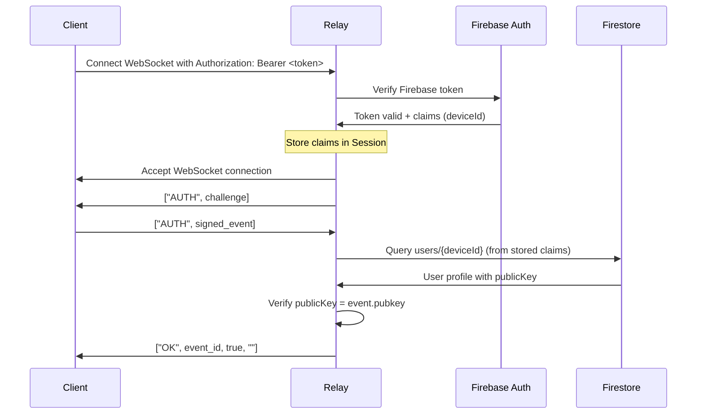

# AUTH NIP-42 App Attestation Implementation Plan

## Executive Summary

This document outlines a plan to restrict WebSocket connections on the rust-nostr-relay to only allow clients who have registered via api.loxation.com with app attestation. The solution integrates Firebase Authentication tokens with NIP-42 challenge-response authentication and uses Firestore to verify device/pubkey mappings.

## Current State Analysis

### 1. AUTH NIP-42 Implementation
- **Status**: Fully implemented in [`extensions/src/auth.rs`](../extensions/src/auth.rs)
- **Mechanism**: Challenge-response using signed events (kind 22242)
- **Features**:
  - IP-based allowlists/blocklists
  - Pubkey-based allowlists/blocklists  
  - Event author pubkey restrictions
  - NIP-70 protected event support

### 2. Authentication Flow
Current NIP-42 flow:
1. Client connects → Server sends `["AUTH", challenge]`
2. Client signs challenge with private key → Sends auth event
3. Server verifies signature → Session authenticated

### 3. Firestore Integration
- **Status**: Implemented in [`extensions/src/mls_gateway/firestore.rs`](../extensions/src/mls_gateway/firestore.rs)
- **Project**: Shares same Google Cloud project as loxation-server
- **Collections**: `mls_groups`, `mls_keypackages`, `roster_policy`, etc.

### 4. Token Infrastructure
- **JWT Support**: Placeholder for jwt_proof in NIP-SERVICE
- **No Token Validation**: Currently no Firebase/JWT token verification
- **No App Attestation**: No verification of app-attested clients

## Requirements Analysis

### User Requirements
1. **Shared Infrastructure**: Same Firebase/Firestore as loxation-server
2. **Identity Mapping**:
   - userId (loxation) = deviceId
   - npub (nostr) = publicKey in user profile
3. **Token Access**: Same token for wss://messaging.loxation.com and https://api.loxation.com
4. **Custom Claims**: Token includes deviceId for Firestore queries
5. **App Attestation**: Only allow app-attested clients from api.loxation.com

### Technical Requirements
1. **Firebase Auth Integration**: Validate tokens from api.loxation.com
2. **Firestore Lookup**: Verify deviceId ↔ pubkey mapping
3. **NIP-42 Enhancement**: Add token validation to auth flow
4. **Backwards Compatibility**: Phased rollout without breaking existing clients

## Proposed Solution Architecture

### 1. Bearer Token Authentication Flow



This approach is cleaner because:
- Uses standard HTTP Authorization header
- Token validation happens once during handshake
- No need to modify NIP-42 message format
- Better separation of concerns

### 2. Data Models

#### WebSocket Connection Headers
```http
GET /ws HTTP/1.1
Host: messaging.loxation.com
Authorization: Bearer eyJhbGc...
Sec-WebSocket-Version: 13
Sec-WebSocket-Key: ...
```

#### Standard NIP-42 AUTH Message (unchanged)
```json
["AUTH", {
  "id": "...",
  "pubkey": "...",
  "created_at": 1234567890,
  "kind": 22242,
  "tags": [["challenge", "..."]],
  "content": "",
  "sig": "..."
}]
```

#### Firebase Token Custom Claims
```json
// Presence of the deviceId in the custom claim indicates the device/client has been app attested
{
  "deviceId": "device123",
  "locationId" ...
  // ... other standard Firebase claims
}
```

#### Firestore User Document
```json
// Collection: users
// Document ID: {deviceId}
{
  "deviceId": "device123",
  "publicKey": "npub1...", // Maps to Nostr pubkey
  "appAttested": true,
  "attestedAt": "2024-01-01T00:00:00Z",
  "lastUpdated": "2024-01-01T00:00:00Z"
}
```

### 3. Component Architecture

#### A. Token Validator Extension
New module: `extensions/src/firebase_auth.rs`
- Firebase Admin SDK integration
- Token verification with custom claims extraction
- Caching for performance

#### B. Dynamic Authorization Function
New function: `allowPubkey(pubkey: String, token: FirebaseToken) -> Result<bool>`
- Extract deviceId from token custom claims (presence = attested)
- Query Firestore to verify deviceId ↔ pubkey mapping
- Cache results for performance

Example implementation:
```rust
pub async fn allow_pubkey(
    pubkey: &str,
    token: &FirebaseToken,
    firestore: &FirestoreStorage,
    cache: &Cache<String, bool>
) -> Result<bool> {
    // Check cache first
    let cache_key = format!("{}:{}", token.device_id, pubkey);
    if let Some(allowed) = cache.get(&cache_key).await {
        return Ok(allowed);
    }
    
    // Extract deviceId from custom claims
    let device_id = token.custom_claims
        .get("deviceId")
        .and_then(|v| v.as_str())
        .ok_or_else(|| anyhow!("No deviceId in token - client not attested"))?;
    
    // Query Firestore for user document
    let user_doc = firestore
        .get_user_by_device_id(device_id)
        .await?
        .ok_or_else(|| anyhow!("Device {} not found in Firestore", device_id))?;
    
    // Verify pubkey matches
    let allowed = user_doc.public_key == pubkey;
    
    // Cache result
    cache.insert(cache_key, allowed, Duration::from_secs(600)).await;
    
    Ok(allowed)
}
```

#### C. Enhanced Auth Extension
Modified: `extensions/src/auth.rs`
- Accept enhanced AUTH with token
- Call allowPubkey() for dynamic verification
- No static whitelists needed

#### D. Configuration
```toml
[auth]
enabled = true
require_app_attestation = true

[auth.firebase]
project_id = "loxation-f8e1c"
token_cache_duration = 300 # 5 minutes

[auth.attestation]
enforce = true  # When false, log violations but allow connection
cache_duration = 600  # 10 minutes for deviceId->pubkey cache
```

## Implementation Code Examples

### 1. Firestore User Query Methods

Add to `extensions/src/mls_gateway/firestore.rs`:

```rust
impl FirestoreStorage {
    /// Get user document by deviceId
    pub async fn get_user_by_device_id(&self, device_id: &str) -> Result<Option<UserProfile>> {
        let doc = self.db
            .fluent()
            .select()
            .by_id_in("users")
            .obj()
            .one(device_id)
            .await?;
        
        Ok(doc)
    }
    
    /// Verify device-pubkey mapping
    pub async fn verify_device_pubkey(&self, device_id: &str, pubkey: &str) -> Result<bool> {
        match self.get_user_by_device_id(device_id).await? {
            Some(user) => Ok(user.public_key == pubkey),
            None => Ok(false),
        }
    }
}

#[derive(Debug, Clone, Serialize, Deserialize)]
pub struct UserProfile {
    pub device_id: String,
    pub public_key: String,
    pub display_name: Option<String>,
    #[serde(with = "chrono::serde::ts_seconds")]
    pub created_at: DateTime<Utc>,
    #[serde(with = "chrono::serde::ts_seconds")]
    pub updated_at: DateTime<Utc>,
}
```

### 2. WebSocket Handler with Token Validation

Modified `relay/src/app.rs`:

```rust
pub async fn websocket(
    req: HttpRequest,
    stream: web::Payload,
    data: web::Data<App>,
) -> Result<HttpResponse, Error> {
    let r = data.setting.read();
    let ip = get_ip(&req, r.network.real_ip_header.as_ref());
    let max_size = r.limitation.max_message_length;
    let require_attestation = r.auth.require_app_attestation;
    drop(r);
    
    // Extract and validate bearer token if attestation is required
    let mut token_claims = None;
    if require_attestation {
        match req.headers().get("Authorization") {
            Some(auth_header) => {
                if let Ok(auth_str) = auth_header.to_str() {
                    if auth_str.starts_with("Bearer ") {
                        let token = &auth_str[7..];
                        match data.firebase_validator.verify_token(token).await {
                            Ok(claims) => {
                                token_claims = Some(claims);
                            }
                            Err(e) => {
                                return Ok(HttpResponse::Unauthorized()
                                    .body(format!("Invalid token: {}", e)));
                            }
                        }
                    } else {
                        return Ok(HttpResponse::Unauthorized()
                            .body("Bearer token required"));
                    }
                } else {
                    return Ok(HttpResponse::BadRequest()
                        .body("Invalid Authorization header"));
                }
            }
            None => {
                return Ok(HttpResponse::Unauthorized()
                    .body("Authorization header required"));
            }
        }
    }
    
    let session = Session::new(ip.unwrap_or_default(), data, token_claims);
    
    ws::WsResponseBuilder::new(session, &req, stream)
        .frame_size(max_size)
        .start()
}
```

### 3. Enhanced Session with Token Claims

Modified `relay/src/session.rs`:

```rust
pub struct Session {
    /// Session id
    pub id: Uuid,
    /// Session ip
    ip: String,
    /// App data
    app: web::Data<App>,
    /// Firebase token claims (if authenticated)
    token_claims: Option<TokenClaims>,
    // ... other fields ...
}

impl Session {
    pub fn new(
        ip: String,
        app: web::Data<App>,
        token_claims: Option<TokenClaims>
    ) -> Self {
        Self {
            id: Uuid::new_v4(),
            ip,
            app,
            token_claims,
            // ... other fields ...
        }
    }
    
    pub fn token_claims(&self) -> Option<&TokenClaims> {
        self.token_claims.as_ref()
    }
}
```

### 4. Updated Auth Extension

Modified `extensions/src/auth.rs`:

```rust
impl Extension for Auth {
    fn message(
        &self,
        msg: ClientMessage,
        session: &mut Session,
        ctx: &mut <Session as actix::Actor>::Context,
    ) -> ExtensionMessageResult {
        match &msg.msg {
            IncomingMessage::Auth(event) => {
                if self.setting.require_app_attestation {
                    // Get token claims stored during WebSocket handshake
                    if let Some(claims) = session.token_claims() {
                        // Validate device-pubkey mapping
                        let future = self.validate_with_claims(
                            event.clone(),
                            claims.clone(),
                            session.clone(),
                        );
                        ctx.spawn(future.into_actor(self));
                        return ExtensionMessageResult::Handled;
                    } else {
                        return OutgoingMessage::ok(
                            &event.id_str(),
                            false,
                            "auth-required: connection not authenticated",
                        ).into();
                    }
                }
                // Fall back to standard NIP-42 auth
                // ... existing auth logic ...
            }
            // ... other message types ...
        }
    }
}
```

### 3. Firebase Token Validator

New file `extensions/src/firebase_auth.rs`:

```rust
use fireauth::{FirebaseAuth, FirebaseAuthError};
use anyhow::{Result, anyhow};
use std::sync::Arc;
use tokio::sync::RwLock;
use cached::proc_macro::cached;
use cached::SizedCache;

pub struct FirebaseTokenValidator {
    auth: Arc<FirebaseAuth>,
    project_id: String,
}

impl FirebaseTokenValidator {
    pub async fn new(project_id: &str) -> Result<Self> {
        let auth = FirebaseAuth::new(project_id).await?;
        Ok(Self {
            auth: Arc::new(auth),
            project_id: project_id.to_string(),
        })
    }
    
    pub async fn verify_token(&self, token: &str) -> Result<TokenClaims> {
        let decoded = self.auth.verify_id_token(token).await?;
        
        // Extract custom claims
        let custom_claims = decoded.claims.get("custom").cloned().unwrap_or_default();
        let device_id = custom_claims
            .get("deviceId")
            .and_then(|v| v.as_str())
            .ok_or_else(|| anyhow!("No deviceId in token - not app attested"))?;
        
        Ok(TokenClaims {
            uid: decoded.uid,
            device_id: device_id.to_string(),
            email: decoded.email,
            exp: decoded.exp,
        })
    }
}

#[derive(Debug, Clone)]
pub struct TokenClaims {
    pub uid: String,
    pub device_id: String,
    pub email: Option<String>,
    pub exp: i64,
}

// Cache token validation results for performance
#[cached(
    type = "SizedCache<String, Result<TokenClaims, String>>",
    create = "{ SizedCache::with_size(1000) }",
    convert = r#"{ token.to_string() }"#,
    result = true
)]
async fn cached_verify_token(
    validator: &FirebaseTokenValidator,
    token: &str
) -> Result<TokenClaims, String> {
    validator.verify_token(token)
        .await
        .map_err(|e| e.to_string())
}
```

### 5. Integration in Auth Extension

```rust
impl Auth {
    async fn validate_with_claims(
        &self,
        event: Event,
        claims: TokenClaims,
        session: Arc<Session>,
    ) -> Result<OutgoingMessage> {
        // Verify NIP-42 signature
        if let Some(AuthState::Challenge(challenge)) = session.get::<AuthState>() {
            let valid_sig = event.verify_challenge(&challenge)?;
            if !valid_sig {
                return Ok(OutgoingMessage::ok(
                    &event.id_str(),
                    false,
                    "auth-required: invalid signature",
                ));
            }
        }
        
        // Token already validated during WebSocket handshake
        // Now just check device-pubkey mapping
        let pubkey = event.pubkey_str();
        let allowed = self.allow_pubkey(&pubkey, &claims).await?;
        
        if allowed {
            session.set(AuthState::Pubkey(pubkey.clone()));
            Ok(OutgoingMessage::ok(&event.id_str(), true, ""))
        } else {
            Ok(OutgoingMessage::ok(
                &event.id_str(),
                false,
                "auth-required: device-pubkey mismatch",
            ))
        }
    }
}
```

### 6. Client Connection Example

```javascript
// Client-side WebSocket connection with bearer token
const token = await firebase.auth().currentUser.getIdToken();
const ws = new WebSocket('wss://messaging.loxation.com', {
    headers: {
        'Authorization': `Bearer ${token}`
    }
});

ws.on('message', async (data) => {
    const msg = JSON.parse(data);
    if (msg[0] === 'AUTH') {
        // Standard NIP-42 auth flow
        const challenge = msg[1];
        const event = await signAuthEvent(challenge, privateKey);
        ws.send(JSON.stringify(['AUTH', event]));
    }
});
```

## Implementation Plan

### Phase 1: Foundation (Week 1-2)
- [ ] Add Firebase Admin SDK dependency (`fireauth` crate)
- [ ] Create firebase_auth extension module
- [ ] Implement token verification logic
- [ ] Add Firestore user lookup functionality
- [ ] Create integration tests

### Phase 2: AUTH Enhancement (Week 2-3)
- [ ] Modify AUTH message parsing to accept token
- [ ] Integrate token validation into auth flow
- [ ] Add deviceId → pubkey verification
- [ ] Implement graceful fallback for missing tokens
- [ ] Update auth extension tests

### Phase 3: Configuration & Monitoring (Week 3-4)
- [ ] Add configuration options for attestation requirements
- [ ] Implement metrics for auth success/failure
- [ ] Add detailed logging for troubleshooting
- [ ] Create monitoring dashboards

### Phase 4: Migration Strategy (Week 4-5)
- [ ] Deploy with attestation in "log-only" mode
- [ ] Analyze client compatibility
- [ ] Create client migration guide
- [ ] Implement gradual enforcement

### Phase 5: Production Rollout (Week 5-6)
- [ ] Enable enforcement for new connections
- [ ] Monitor error rates and client issues
- [ ] Provide grace period for client updates
- [ ] Full enforcement with allowlist override

## Security Considerations

### 1. Token Security
- **Token Expiry**: Honor Firebase token expiration
- **Token Refresh**: Clients must handle token refresh
- **Token Revocation**: Check Firebase for revoked tokens

### 2. Race Conditions
- **Pubkey Changes**: Handle pubkey updates in Firestore
- **Cache Invalidation**: Expire cached mappings appropriately
- **Attestation Status**: Re-verify attestation periodically

### 3. Attack Vectors
- **Replay Attacks**: Include timestamp in challenge
- **Token Stealing**: Tokens bound to device/pubkey
- **Attestation Bypass**: Strict verification of attestation claims

### 4. Privacy
- **Minimal Logging**: Don't log tokens or sensitive data
- **Pubkey Privacy**: No unnecessary pubkey exposure
- **Correlation**: Prevent deviceId ↔ pubkey correlation leaks

## Edge Cases

1. **Token Expired During Session**
   - Keep session valid until disconnect
   - Require fresh token on reconnect

2. **Pubkey Mismatch**
   - Reject auth if Firebase pubkey ≠ Nostr pubkey
   - Log for security monitoring

3. **Missing User Document**
   - Deny access if user not in Firestore
   - Consider sync delay grace period

4. **Network Issues**
   - Cache Firebase keys for offline validation
   - Fallback to deny on Firebase timeout

5. **Legacy Clients**
   - Detect clients without token support
   - Provide migration period with warnings

## Testing Strategy

### Unit Tests
- Token validation with valid/invalid tokens
- Firestore lookup success/failure cases
- Pubkey matching logic
- Cache behavior

### Integration Tests
- Full auth flow with Firebase emulator
- Firestore emulator for user lookups
- Error scenarios and edge cases
- Performance under load

### End-to-End Tests
- Real client with attestation
- Token refresh during session
- Connection retry behavior
- Monitoring and alerting

## Monitoring & Operations

### Metrics Implementation

```rust
use metrics::{counter, histogram, describe_counter, describe_histogram};

pub fn init_metrics() {
    describe_counter!(
        "nostr_relay_auth_attestation_attempts",
        "Total auth attempts with attestation status"
    );
    describe_histogram!(
        "nostr_relay_token_validation_duration",
        "Time taken to validate Firebase tokens"
    );
    describe_histogram!(
        "nostr_relay_firestore_lookup_duration",
        "Time taken for Firestore user lookups"
    );
    describe_counter!(
        "nostr_relay_attestation_cache_hits",
        "Cache hit rate for device-pubkey mappings"
    );
}

// Usage in code
counter!(
    "nostr_relay_auth_attestation_attempts",
    "status" => "success",
    "has_token" => "true",
    "attested" => "true"
).increment(1);

let start = Instant::now();
let result = firebase_validator.verify_token(&token).await;
histogram!("nostr_relay_token_validation_duration").record(start.elapsed());
```

### Detailed Metrics
- `nostr_relay_auth_attestation_attempts{status="success|failure|no_token|invalid_token|pubkey_mismatch",has_token="true|false",attested="true|false"}`
- `nostr_relay_token_validation_duration_seconds` - P50, P95, P99 latencies
- `nostr_relay_firestore_lookup_duration_seconds` - P50, P95, P99 latencies
- `nostr_relay_attestation_cache_hits{hit="true|false"}` - Cache effectiveness
- `nostr_relay_firebase_api_errors{error_type="timeout|auth_error|service_error"}`
- `nostr_relay_attestation_enforcement{mode="enforce|log_only|disabled"}`

### Alerts Configuration

```yaml
# prometheus-alerts.yml
groups:
  - name: attestation_auth
    rules:
      - alert: HighAuthFailureRate
        expr: |
          rate(nostr_relay_auth_attestation_attempts{status!="success"}[5m])
          / rate(nostr_relay_auth_attestation_attempts[5m]) > 0.1
        for: 5m
        labels:
          severity: warning
        annotations:
          summary: High authentication failure rate
          description: "Auth failure rate is {{ $value | humanizePercentage }}"
      
      - alert: FirebaseAPIErrors
        expr: rate(nostr_relay_firebase_api_errors[5m]) > 0.1
        for: 2m
        labels:
          severity: critical
        annotations:
          summary: Firebase API errors detected
          description: "Firebase API error rate: {{ $value }} errors/sec"
      
      - alert: SlowTokenValidation
        expr: |
          histogram_quantile(0.95, rate(nostr_relay_token_validation_duration_seconds_bucket[5m])) > 0.5
        for: 5m
        labels:
          severity: warning
        annotations:
          summary: Token validation is slow
          description: "95th percentile token validation: {{ $value }}s"
```

### Structured Logging

```rust
use tracing::{info, warn, error, instrument};
use serde_json::json;

#[instrument(skip(token, firestore), fields(pubkey = %pubkey))]
pub async fn authenticate_with_attestation(
    pubkey: &str,
    token: &str,
    firestore: &FirestoreStorage,
) -> Result<bool> {
    // Log auth attempt
    info!(
        target: "auth_attestation",
        pubkey = %pubkey,
        has_token = true,
        "Auth attempt with attestation"
    );
    
    // Validate token
    match validate_token(token).await {
        Ok(claims) => {
            info!(
                target: "auth_attestation",
                device_id = %claims.device_id,
                token_exp = claims.exp,
                "Token validated successfully"
            );
            
            // Verify mapping
            match firestore.verify_device_pubkey(&claims.device_id, pubkey).await {
                Ok(true) => {
                    info!(
                        target: "auth_attestation",
                        device_id = %claims.device_id,
                        pubkey = %pubkey,
                        "Device-pubkey mapping verified"
                    );
                    Ok(true)
                },
                Ok(false) => {
                    warn!(
                        target: "auth_attestation",
                        device_id = %claims.device_id,
                        pubkey = %pubkey,
                        expected_pubkey = ?firestore.get_user_by_device_id(&claims.device_id).await?.map(|u| u.public_key),
                        "Device-pubkey mismatch"
                    );
                    Ok(false)
                },
                Err(e) => {
                    error!(
                        target: "auth_attestation",
                        error = %e,
                        device_id = %claims.device_id,
                        "Firestore lookup failed"
                    );
                    Err(e)
                }
            }
        },
        Err(e) => {
            warn!(
                target: "auth_attestation",
                error = %e,
                pubkey = %pubkey,
                "Token validation failed"
            );
            Err(e)
        }
    }
}
```

### Monitoring Dashboard (Grafana)

```json
{
  "dashboard": {
    "title": "Nostr Relay App Attestation",
    "panels": [
      {
        "title": "Auth Success Rate",
        "targets": [{
          "expr": "rate(nostr_relay_auth_attestation_attempts{status=\"success\"}[5m]) / rate(nostr_relay_auth_attestation_attempts[5m])"
        }]
      },
      {
        "title": "Auth Failures by Type",
        "targets": [{
          "expr": "rate(nostr_relay_auth_attestation_attempts{status!=\"success\"}[5m]) by (status)"
        }]
      },
      {
        "title": "Token Validation Latency",
        "targets": [{
          "expr": "histogram_quantile(0.95, rate(nostr_relay_token_validation_duration_seconds_bucket[5m]))"
        }]
      },
      {
        "title": "Cache Hit Rate",
        "targets": [{
          "expr": "rate(nostr_relay_attestation_cache_hits{hit=\"true\"}[5m]) / rate(nostr_relay_attestation_cache_hits[5m])"
        }]
      }
    ]
  }
}
```

## Migration Timeline

1. **Week 1-2**: Development and testing
2. **Week 3**: Deploy to staging environment
3. **Week 4**: Production deploy (log-only mode)
4. **Week 5**: Enable for 10% of connections
5. **Week 6**: Gradual rollout to 100%
6. **Week 8**: Remove legacy auth support

## Success Criteria

1. **Security**: 100% of connections from attested clients
2. **Reliability**: <0.1% auth failures due to system issues  
3. **Performance**: <100ms added latency for auth
4. **Compatibility**: 95% client migration within 30 days
5. **Operations**: Zero attestation bypass incidents

## Conclusion

This plan provides a secure, phased approach to restricting the rust-nostr-relay to app-attested clients. By leveraging the existing Firebase/Firestore infrastructure and enhancing NIP-42 authentication, we can ensure only verified clients access the relay while maintaining backwards compatibility during migration.

The implementation balances security requirements with operational concerns, providing monitoring, gradual rollout, and comprehensive testing to ensure a smooth transition.