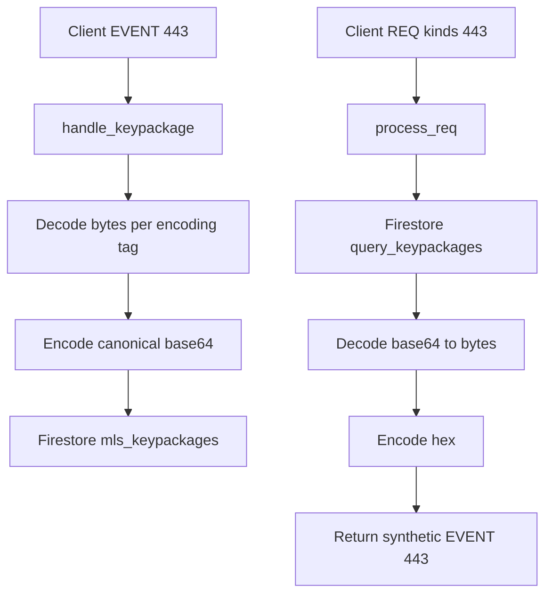

# KeyPackage base64 canonical storage in Firestore (Stage 1)

Goal: keep all Firestore keypackage payloads (`kind: 443` content) in canonical base64 for storage efficiency, while preserving compatibility with existing clients by continuing to *deliver hex by default*.

## Objectives

- **Canonical Firestore storage**: store `KeyPackageBundle` bytes as **base64** in Firestore only.
- **Backward compatible delivery**: when serving keypackages via REQ, return **hex content by default**, so currently deployed clients continue to work unchanged.
- **Ingest compatibility**: accept inbound `kind: 443` events where `content` is:
  - **hex** when the `encoding` tag is absent (default)
  - **base64** when the `encoding` tag is present and set to `base64`
- **Convergence**: handle legacy Firestore docs that already store hex (no downtime migration required).

## Non-goals (Stage 1)

- No relay-core changes to support multi-character tag keys in filters (e.g. `#encoding`).
- No client-facing REQ encoding negotiation yet (base64 on request can be Phase 2).
- No changes to LMDB storage behavior for `kind: 443` (still Firestore-driven).

## Contract / invariants

### Ingest contract (incoming `kind: 443`)

Implement in [`MlsGateway::handle_keypackage()`](extensions/src/mls_gateway/mod.rs:669)

- Determine the *declared* content encoding:
  - If tag `[`encoding`, `base64`]` exists: treat `event.content` as base64
  - If the `encoding` tag is absent: treat `event.content` as hex (backward compatible)
- Decode content to bytes, then **re-encode to canonical base64** for storage.
- Store the canonical base64 string in Firestore via [`FirestoreStorage::store_keypackage()`](extensions/src/mls_gateway/firestore.rs:615)

Notes:

- Canonical base64 should be deterministic. Recommended: RFC4648 **standard base64 with padding** (encode via a single engine everywhere).
- Decoder should be tolerant when ingesting base64: accept both padded/unpadded where possible; consider trying both STANDARD and URL_SAFE engines if needed.

### Firestore storage contract

Implemented in [`KeyPackageDoc`](extensions/src/mls_gateway/firestore.rs:54)

- **Firestore is canonical**: stored content is always base64.

No `content_encoding` field is used (by decision). The relay assumes Firestore `content` is canonical base64.

Legacy docs may still exist temporarily (hex content). Our operational plan is to purge them prior to rollout; optionally keep a defensive read fallback (attempt hex decode if base64 decode fails) during the transition.

### Delivery contract (REQ queries for `kind: 443`)

Implemented in [`MlsGateway::process_req()`](extensions/src/mls_gateway/mod.rs:1403) and [`MlsGateway::post_process_query_results()`](extensions/src/mls_gateway/mod.rs:1525)

- Stage 1 default: **deliver hex `content`**.
- When reading Firestore:
  1. decode base64 -> bytes
  2. hex-encode bytes for the synthetic outgoing 443

Compatibility guarantee:

- Existing clients that do not understand `encoding=base64` will continue to receive hex payloads.

### Optional Phase 2 (REQ asks for base64)

Support returning base64 when a client explicitly requests it.

Tradeoff notes:

- The relay’s core filter parsing only supports single-character `#` tags (see [`Filter`](db/src/filter.rs:46)), so `#encoding` is not currently representable.
- To support `encoding` or `#encoding` without core changes, the extension can parse the raw REQ JSON string in the session layer and pass the preference into the MLS gateway logic.

Stage 1 explicitly **does not** implement this.

## Data-flow diagram

## Implementation plan (actionable)

### 1) Add encoding helpers (shared, testable)

- Add a small utility module in the MLS gateway extension (new file) to:
  - detect declared encoding from tags
  - decode hex -> bytes
  - decode base64 -> bytes
  - encode bytes -> canonical base64
  - encode bytes -> hex

### 2) Ingest: write base64 only

- Update [`MlsGateway::handle_keypackage()`](extensions/src/mls_gateway/mod.rs:669):
  - parse `encoding` tag
  - validate + decode accordingly
  - store **base64** string (not hex) to Firestore
  - increment metrics for `encoding=hex_default` vs `encoding=base64`

### 3) Firestore schema: make encoding explicit

- Extend [`KeyPackageDoc`](extensions/src/mls_gateway/firestore.rs:54) with `content_encoding`.
- On new writes, set `content_encoding = "base64"`.
- On reads, return both `content` and `content_encoding` to the caller.

### 4) Read-path compatibility for legacy Firestore docs

Goal: no hard migration required.

- When reading a doc:
  - If `content_encoding == base64`: decode as base64
  - Else (missing or other): attempt to decode as hex
    - if hex decodes, treat as legacy and optionally **lazy-rewrite** the doc to base64 + set `content_encoding`

This converges the database over time even if a separate backfill is not run.

## Rollout plan (given clients republish on startup)

You indicated clients publish ~5 new KeyPackages on startup, which allows a simplified rollout:

1. **Deploy code that writes base64** (ingest converts to base64; Firestore stores base64 only).
2. **Purge existing Firestore `mls_keypackages` docs** that contain hex content.
   - Caveat: there may be a brief window where some users have 0 keypackages until their clients reconnect/start.
3. **Verify** via logs/metrics that new 443 ingests are being stored as base64.
4. **Verify delivery**: REQ returns hex content (default) so old clients continue to work.

Optional hardening (still recommended even with purge):

- Keep a small dual-read fallback (attempt hex decode if base64 decode fails) for safety during transition.

### 5) Query: default return hex

- Update [`MlsGateway::process_req()`](extensions/src/mls_gateway/mod.rs:1403) to:
  - assume Firestore returns base64 content
  - decode+hex-encode before building the outgoing synthetic 443 event

### 6) Fix Firestore fallback path

- Update [`MlsGateway::post_process_query_results()`](extensions/src/mls_gateway/mod.rs:1525):
  - remove parsing Firestore `content` as full event JSON
  - reconstruct the synthetic 443 events the same way as in `process_req`

### 7) Migration tool (optional but recommended)

- Add an idempotent backfill tool (e.g. a `--bin` or `--example`) to scan `mls_keypackages`:
  - for docs missing `content_encoding`, decode hex and rewrite to base64
  - safe to rerun

### 8) Observability

- Add counters for:
  - inbound 443 by declared encoding
  - decode failures (hex/base64)
  - legacy-doc conversions (lazy and backfill)

### 9) Tests

- Update unit/integration tests to cover:
  - inbound hex 443 -> stored base64
  - inbound base64 443 -> stored base64
  - Firestore legacy hex doc -> returned hex to requester
  - Firestore base64 doc -> returned hex to requester

Targets:

- [`extensions/src/mls_gateway/test_req_interception.rs`](extensions/src/mls_gateway/test_req_interception.rs)
- [`extensions/src/mls_gateway/test_keypackage_flow.rs`](extensions/src/mls_gateway/test_keypackage_flow.rs)

### 10) Docs alignment

- Ensure docs consistently describe:
  - `encoding` tag semantics for `kind: 443`
  - Stage 1 default delivery is hex
  - base64 is canonical in Firestore

Targets:

- [`docs/CLIENT_KEYPACKAGE_QUERY_GUIDE.md`](docs/CLIENT_KEYPACKAGE_QUERY_GUIDE.md)
- [`MIP-00.md`](MIP-00.md)
- [`NIP-EE-RELAY.md`](NIP-EE-RELAY.md)
