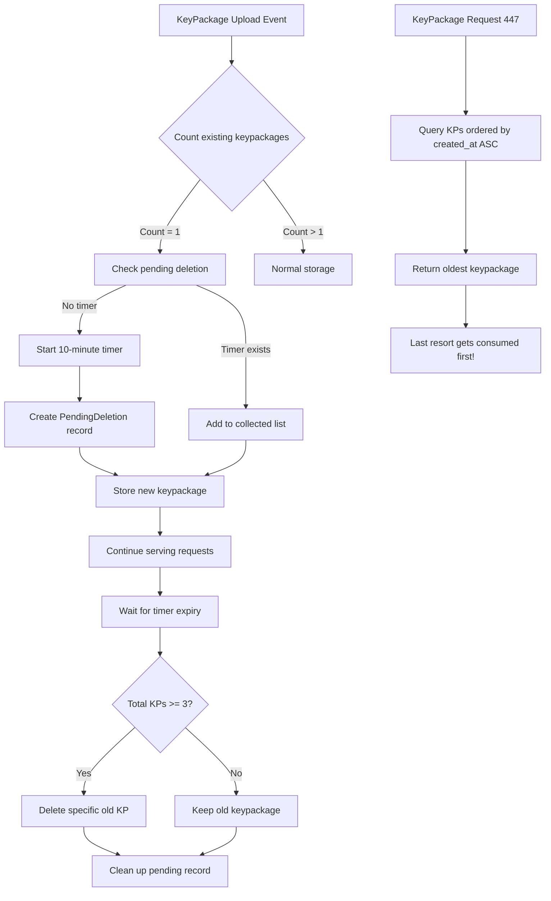

# Last Resort KeyPackage Reuse Mitigation Plan

## Overview
This plan addresses the issue of "last resort keypackage reuse" by implementing a timer-based deletion mechanism when users upload new keypackages while having only one existing keypackage. The old keypackage is only deleted if at least 2 new keypackages are uploaded during the grace period.

## Current Implementation Analysis
- The system currently preserves the last remaining keypackage for each user
- [`delete_consumed_keypackage`](../extensions/src/mls_gateway/firestore.rs:488) checks keypackage count and refuses to delete if count <= 1
- Keypackages are stored with metadata including owner_pubkey, event_id, created_at, expires_at
- The [`handle_keypackage`](../extensions/src/mls_gateway/mod.rs:580) function processes kind 443 events

## Problem Statement
When a user has only one keypackage (the "last resort"), and uploads new ones, the old keypackage should be deleted after a grace period to prevent indefinite reuse - but only if the user uploads at least 2 new keypackages, ensuring robust availability.

**Key Innovation**: By always returning the oldest keypackage first in response to requests, we ensure natural rotation. Even if only 1 new keypackage is uploaded, the last resort keypackage will be consumed and rotated out of active use.

## Proposed Solution

### 1. New Data Structures

#### PendingDeletion struct
```rust
struct PendingDeletion {
    user_pubkey: String,
    old_keypackage_id: String,
    new_keypackages_collected: Vec<String>,
    timer_started_at: DateTime<Utc>,
    deletion_scheduled_at: DateTime<Utc>,
}
```

#### Storage Options
- **Option A**: In-memory HashMap with periodic persistence
- **Option B**: Firestore collection `mls_pending_deletions`
- **Recommendation**: Use Firestore for persistence across restarts

### 2. Implementation Flow

#### Complete Flow with Rotation Strategy:



This ensures that:
- The oldest (last resort) keypackage is always returned first
- Even with 1 new keypackage uploaded, rotation happens naturally
- After 10 minutes, if 2+ new keypackages exist, the old one is deleted
- If only 1 new keypackage was uploaded, both are kept for redundancy

### 3. Detailed Implementation Steps

#### A. Modify keypackage request handling to return oldest first
```rust
async fn handle_keypackage_request(&self, event: &Event) -> anyhow::Result<()> {
    // ... existing validation ...
    
    // CRITICAL: Query keypackages ordered by created_at ASC (oldest first)
    // This ensures the "last resort" keypackage gets used first when new ones are uploaded
    let keypackages = store.query_keypackages(
        Some(&[recipient_pubkey.clone()]),
        None,
        Some(min_count.max(10)),
        Some("created_at_asc")  // New parameter for ordering
    ).await?;
    
    // Return the oldest keypackage, ensuring rotation
    if let Some((event_id, owner, content, created_at)) = keypackages.first() {
        // Mark as consumed (will be preserved if it's the last one)
        store.delete_consumed_keypackage(event_id).await?;
        // ... send response ...
    }
}
```

#### B. Modify `handle_keypackage` upload function
```rust
async fn handle_keypackage(&self, event: &Event) -> anyhow::Result<()> {
    // ... existing validation ...
    
    let store = self.store()?;
    let event_pubkey = hex::encode(event.pubkey());
    
    // Check current keypackage count BEFORE storing new one
    let current_count = store.count_user_keypackages(&event_pubkey).await?;
    
    // If user has exactly 1 keypackage, capture its ID for future deletion
    let old_keypackage_id = if current_count == 1 {
        // Get the single existing keypackage ID
        let existing_kps = store.query_keypackages(
            Some(&[event_pubkey.clone()]),
            None,
            Some(1),
            None
        ).await?;
        existing_kps.first().map(|(id, _, _, _)| id.clone())
    } else {
        None
    };
    
    // Store the new keypackage
    store.store_keypackage(/* ... */).await?;
    
    // If we captured an old keypackage ID, start the deletion timer
    if let Some(old_kp_id) = old_keypackage_id {
        self.handle_last_resort_transition(&event_pubkey, &old_kp_id, &event.id_str()).await?;
    }
    
    Ok(())
}
```

#### B. Update storage interface for ordering
```rust
// Add ordering parameter to query_keypackages
async fn query_keypackages(
    &self,
    owner_pubkeys: Option<&[String]>,
    since: Option<i64>,
    limit: Option<usize>,
    order_by: Option<&str>,  // New parameter: "created_at_asc" or "created_at_desc"
) -> anyhow::Result<Vec<(String, String, String, i64)>>;
```

#### C. Timer Management
```rust
async fn handle_last_resort_transition(
    &self,
    user_pubkey: &str,
    old_kp_id: &str,
    new_kp_id: &str
) -> anyhow::Result<()> {
    let store = self.store()?;
    
    // Check if timer already running for this user
    if let Some(mut pending) = store.get_pending_deletion(user_pubkey).await? {
        // Verify it's for the same old keypackage
        if pending.old_keypackage_id == old_kp_id {
            // Add to collected list
            pending.new_keypackages_collected.push(new_kp_id.to_string());
            store.update_pending_deletion(&pending).await?;
            info!("Added keypackage {} to pending deletion for user {} (total collected: {})",
                  new_kp_id, user_pubkey, pending.new_keypackages_collected.len());
        } else {
            // Different old keypackage - this shouldn't happen but log it
            warn!("Timer already running for different keypackage {} vs {}",
                  pending.old_keypackage_id, old_kp_id);
        }
    } else {
        // Start new timer with precise old keypackage ID
        let pending = PendingDeletion {
            user_pubkey: user_pubkey.to_string(),
            old_keypackage_id: old_kp_id.to_string(), // Precise ID captured before insert
            new_keypackages_collected: vec![new_kp_id.to_string()],
            timer_started_at: Utc::now(),
            deletion_scheduled_at: Utc::now() + Duration::minutes(10),
        };
        store.create_pending_deletion(&pending).await?;
        
        info!("Starting deletion timer for last resort keypackage {} of user {}",
              old_kp_id, user_pubkey);
        
        // Spawn timer task
        let store_clone = store.clone();
        let user_pubkey = user_pubkey.to_string();
        tokio::spawn(async move {
            tokio::time::sleep(Duration::minutes(10)).await;
            if let Err(e) = process_pending_deletion(&store_clone, &user_pubkey).await {
                error!("Failed to process pending deletion: {}", e);
            }
        });
    }
    
    Ok(())
}
```

#### D. Deletion Logic
```rust
async fn process_pending_deletion(store: &StorageBackend, user_pubkey: &str) -> anyhow::Result<()> {
    if let Some(pending) = store.get_pending_deletion(user_pubkey).await? {
        // Get total count of valid keypackages for the user
        let total_valid_count = store.count_user_keypackages(user_pubkey).await?;
        
        info!("Processing pending deletion for user {}: old_kp={}, collected={}, total_valid={}",
              user_pubkey, pending.old_keypackage_id,
              pending.new_keypackages_collected.len(), total_valid_count);
        
        // Only delete if we have a healthy pool (3-5 valid keypackages)
        const MIN_HEALTHY_POOL_SIZE: u32 = 3; // Configure as needed
        
        if total_valid_count >= MIN_HEALTHY_POOL_SIZE {
            // Verify the old keypackage still exists before deletion
            if store.keypackage_exists(&pending.old_keypackage_id).await? {
                // Use direct deletion (not delete_consumed) to bypass the "last one" check
                store.delete_keypackage_by_id(&pending.old_keypackage_id).await?;
                info!("Successfully deleted old last resort keypackage {} for user {} (pool size: {})",
                      pending.old_keypackage_id, user_pubkey, total_valid_count);
                counter!("mls_gateway_last_resort_deletions_executed").increment(1);
            } else {
                info!("Old keypackage {} already deleted for user {}",
                      pending.old_keypackage_id, user_pubkey);
            }
        } else {
            info!("Preserving last resort keypackage {} for user {} - pool not healthy (size: {})",
                  pending.old_keypackage_id, user_pubkey, total_valid_count);
            counter!("mls_gateway_last_resort_deletions_cancelled").increment(1);
        }
        
        // Clean up pending deletion record regardless of outcome
        store.delete_pending_deletion(user_pubkey).await?;
    }
    
    Ok(())
}
```

### 4. Edge Cases to Handle

1. **User uploads exactly 2 keypackages**: Timer waits full 10 minutes then deletes old one
2. **User uploads 1 keypackage then nothing**: Old keypackage preserved
3. **New keypackages deleted before timer expires**: Verify they still exist before deletion
4. **System restart during timer**: Resume timers based on scheduled deletion time
5. **Multiple rapid uploads**: All tracked in collected list

### 5. Monitoring & Logging

- Log timer start: "Starting last resort deletion timer for user X (current KP: Y)"
- Log collection: "Collected new keypackage Z for user X (total: N)"
- Log rotation: "Returning oldest keypackage Y for user X (age: N days)"
- Log decision: "Timer expired for user X: collected N keypackages, decision: DELETE/PRESERVE"
- Add metrics:
  - `mls_gateway_last_resort_timers_started`
  - `mls_gateway_last_resort_deletions_executed`
  - `mls_gateway_last_resort_deletions_cancelled`
  - `mls_gateway_keypackage_age_at_consumption` (histogram)

### 6. Configuration

Add to MLS Gateway config:
```toml
# Grace period before deleting former last resort keypackage (seconds)
last_resort_deletion_delay = 600  # 10 minutes

# Minimum total keypackages for healthy pool (triggers deletion)
min_healthy_pool_size = 3  # or 5, depending on security requirements

# Maximum keypackages to track during grace period
max_tracked_keypackages = 10
```

### 7. Testing Strategy

1. **Unit Tests**:
   - Test with 0, 1, 2, 3+ new keypackages
   - Test keypackage deletion during timer period
   - Test timer cancellation logic

2. **Integration Tests**:
   - Simulate full flow with timer
   - Test system restart during timer
   - Test concurrent uploads

3. **Load Tests**:
   - Multiple users with timers
   - Rapid keypackage uploads

## Migration Considerations

- Add new Firestore collection: `mls_pending_deletions`
- Add indexes for efficient queries by user_pubkey
- No changes to existing keypackages collection
- Feature flag to enable/disable during rollout

## Security Considerations

- Atomic operations to prevent race conditions
- Verify user identity throughout the process
- Comprehensive audit logging
- Ensure deletion can't be triggered maliciously
- Rate limiting on keypackage uploads

### KeyPackage Request Rate Limiting (Invite Spam Prevention)

To prevent keypackage exhaustion through excessive keypackage requests (kind 447) while a user is offline:

```rust
// Per requester→recipient rate limiting for keypackage requests
struct KeyPackageRequestRateLimit {
    requester_pubkey: String,    // Who is requesting keypackages
    recipient_pubkey: String,    // Whose keypackages are being requested
    request_count: u32,
    window_start: DateTime<Utc>,
}

// Configuration options
struct KeyPackageRequestRateLimitConfig {
    // Option 1: Simple rate limit
    max_requests_per_window: u32,        // e.g., 5 requests
    window_duration_seconds: u64,        // e.g., 3600 (1 hour)
    
    // Option 2: Token bucket
    bucket_capacity: u32,                // e.g., 10 tokens
    refill_rate_per_minute: f64,         // e.g., 1.0 token/minute
    
    // Option 3: Proof of work (for unknown/untrusted requesters)
    pow_difficulty: u32,                 // e.g., 20 bits of leading zeros
}
```

#### Implementation in `handle_keypackage_request`:
```rust
async fn handle_keypackage_request(&self, event: &Event) -> anyhow::Result<()> {
    let requester_pubkey = hex::encode(event.pubkey());
    
    // Extract recipient from 'p' tag
    let recipient_pubkey = /* ... extract from event tags ... */;
    
    // Check rate limit for this requester→recipient pair
    if !self.check_keypackage_request_rate_limit(&requester_pubkey, &recipient_pubkey).await? {
        warn!("Rate limit exceeded for keypackage request from {} to {}",
              requester_pubkey, recipient_pubkey);
        counter!("mls_gateway_keypackage_requests_rate_limited").increment(1);
        return Err(anyhow::anyhow!("Rate limit exceeded"));
    }
    
    // Continue with normal keypackage request handling...
    // Return oldest keypackage first (as per rotation strategy)
}
```

Implementation approach:
1. Track keypackage requests per requester→recipient pair
2. Reject requests that exceed rate limit
3. Consider requiring proof-of-work for requests from unknown/untrusted pubkeys
4. Allow higher rates for mutual contacts or established relationships
5. Store rate limit data in Firestore for persistence